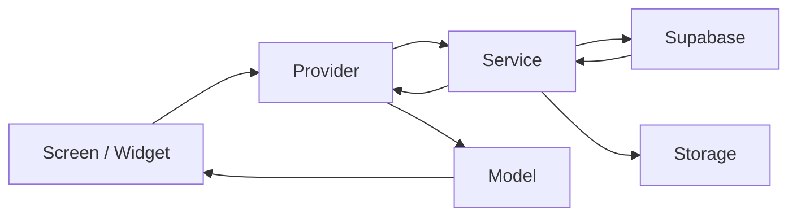

# شرح الأكواد داخل ملفات مشروع Shams Mobile App

تاريخ التوثيق: 2026-06-03

هذا الملف مكمل لملف [PROJECT_STRUCTURE_AR.md](PROJECT_STRUCTURE_AR.md). الملف السابق يشرح الهيكلية والعلاقات، أما هذا الملف فيشرح ماذا يفعل الكود داخل كل ملف، خصوصًا ملفات Dart داخل `lib/` لأنها تمثل منطق التطبيق الحقيقي.

طريقة القراءة المقترحة:

- ابدأ من `lib/main.dart`.
- انتقل إلى `providers/` لفهم الحالة.
- اقرأ `services/` لفهم الاتصال بـ Supabase.
- راجع `models/` لفهم شكل البيانات.
- بعدها اقرأ `views/` و`widgets/` لفهم الواجهة.

## الفكرة البرمجية العامة

الكود مبني على نمط عملي:

معنى ذلك أن الشاشة لا يفترض أن تحمل كل منطق البيانات. الشاشة تعرض وتستقبل تفاعل المستخدم، ثم تستدعي Provider. الـ Provider يحدث الحالة، يستدعي Service، يحول البيانات إلى Model، ثم ينادي `notifyListeners()` لتتحدث الواجهة.

## ملف التشغيل الرئيسي

### `lib/main.dart`

هذا هو ملف البداية للتطبيق.

أهم ما يفعله الكود:

- يستدعي `WidgetsFlutterBinding.ensureInitialized()` حتى تكون قنوات Flutter الأصلية جاهزة قبل استخدام `SystemChrome` أو Supabase.
- يقفل اتجاه التطبيق على الوضع العمودي عبر `SystemChrome.setPreferredOrientations`.
- يهيئ Supabase باستخدام `Supabase.initialize`.
- يلف التطبيق داخل `MultiProvider` حتى تصبح الحالة العامة متاحة لكل الشاشات.
- ينشئ Providers التالية:
  - `WorkshopProvider`
  - `UserProvider`
  - `FeedProvider`
  - `ChatProvider`
  - `NotificationProvider`
- يستخدم `ChangeNotifierProxyProvider<WorkshopProvider, FeedProvider>` حتى يستطيع `FeedProvider` أن يعرف بيانات الورش إذا احتاجها. حاليًا `initializeFromWorkshops` موجودة للتوافق فقط لأن التغذية تجلب بياناتها مباشرة من Supabase.
- يعرف `ShamsApp` كـ `StatelessWidget`.
- داخل `ShamsApp.build` ينشئ `MaterialApp`، يضبط الثيم، اللغة العربية، ودوال التعريب.
- `home` هي `AuthGate`، أي أن أول قرار في التطبيق هو: هل المستخدم مسجل دخوله محليًا أم لا؟

سبب الربط:

- `main.dart` يستورد Providers لأن هذه هي الحالة العامة للتطبيق كله.
- يستورد `ShamsTheme` لأن الثيم يطبق على كل الشاشات.
- يستورد `AuthGate` لأنها بوابة البداية.

## النماذج Models

النماذج هي كائنات Dart تمثل بيانات قاعدة البيانات أو بيانات الواجهة. فائدتها أنها تمنع التعامل مع `Map<String, dynamic>` في كل مكان.

### `lib/models/user_model.dart`

يمثل المستخدم.

الحقول الأساسية:

- `id`: معرف المستخدم، غالبًا نفس معرف Supabase Auth.
- `name`, `email`, `username`, `phone`, `bio`, `location`.
- `profileImageUrl`: رابط الصورة.
- `isVerified`: هل المستخدم موثق.
- `hasWorkshop`: هل لديه ورشة.

أهم الدوال:

- `copyWith`: ترجع نسخة جديدة مع تغيير حقول معينة. هذا مفيد لأن الكود يتعامل مع النماذج كقيم شبه ثابتة.
- `toMap`: يحول النموذج إلى Map لحفظه أو تمريره.
- `fromMap`: يحول Map قادم من Supabase أو من كود محلي إلى `UserModel`.

أين يستخدم:

- `UserProvider`.
- `ChatModel` كمشارك في المحادثة.
- `PostModel` كمؤلف منشور.
- `CommentModel` و`ReviewModel`.

### `lib/models/post_model.dart`

يمثل منشور الورشة.

الحقول:

- `id`, `workshopId`.
- `textDetails`: نص المنشور.
- `images`: روابط أو مسارات الصور.
- `isLocalFile`: هل الصور ملفات محلية أم روابط.
- `viewsCount`, `createdAt`.
- `isHighlighted`: هل المنشور مميز.
- `author`: `UserModel`.
- `likesCount`, `isLiked`.
- `comments`: قائمة `CommentModel`.

أهم الدوال:

- `copyWith`: تحديث نسخة من المنشور عند الإعجاب أو تعديل التعليقات.
- `toMap` و`fromMap`: تحويل محلي.
- `_timeAgo`: يحول تاريخ Supabase إلى نص عربي تقريبي مثل "منذ 3 دقيقة".
- `fromSupabase`: أهم Factory. يأخذ أسماء أعمدة Supabase مثل `text_details`, `workshop_id`, `views_count` ويحولها إلى حقول Dart.

سبب الربط:

- يستورد `UserModel` لأن المنشور له مؤلف.
- يستورد `CommentModel` لأن المنشور يحتوي تعليقات.

### `lib/models/comment_model.dart`

يمثل تعليقًا على منشور.

الحقول:

- `id`, `postId`.
- `user`: صاحب التعليق.
- `text`.
- `likesCount`, `isLiked`.
- `timestamp`.

أهم الدوال:

- `copyWith`: لتحديث الإعجاب أو العدد.
- `toMap`, `fromMap`: تحويل محلي.
- `fromSupabase`: يقرأ بيانات `comments` ومعها `profiles`.

سبب الربط:

- يستخدم `UserModel` لأن كل تعليق له صاحب.
- يستخدمه `FeedProvider` و`CommentsComponent`.

### `lib/models/public_workshop_model.dart`

يمثل ورشة معروضة للعامة.

الحقول:

- `id`, `ownerId`.
- `name`, `handle`, `city`, `description`.
- `rating`, `reviewCount`.
- `logoPath`, `coverImagePath`.
- `isFollowing`.
- `posts`: منشورات الورشة.
- `serviceTypes`, `phone`, `whatsapp`.
- `yearsOfExperience`, `isVerified`.
- `reviews`.

أهم الدوال:

- `copyWith`: لتحديث حالة المتابعة أو بيانات الورشة بدون إعادة بناء النموذج من الصفر.
- `fromSupabase`: يحول سجل `workshops` إلى نموذج.
- `toUserModel`: يحول الورشة إلى مستخدم دردشة. هذا مهم لأن المحادثة تكون بين مستخدم ومالك الورشة، والواجهة تريد عرض الورشة كطرف محادثة.

سبب الربط:

- يستورد `PostModel` و`ReviewModel` لأن صفحة الورشة تعرض منشورات وتقييمات.
- يستورد `UserModel` للتحويل إلى مشارك محادثة.

### `lib/models/workshop_data.dart`

يمثل بيانات الورشة الخاصة بصاحبها.

هذا النموذج مختلف عن `PublicWorkshopModel` لأنه يستخدم داخل الإنشاء والتعديل ولوحة الإدارة.

الحقول:

- بيانات ثابتة: `id`, `ownerId`, `name`, `username`, `city`, `description`, `yearsOfExperience`.
- صور محلية قبل الرفع: `profileImage`, `coverImage`, `extraImages`.
- روابط بعد الرفع: `logoUrl`, `coverUrl`, `galleryUrls`.

أين يستخدم:

- `AddWorkshopScreen` عند إنشاء ورشة.
- `WorkshopDashboardScreen` عند إدارة الورشة.
- `WorkshopProvider.myWorkshop`.

### `lib/models/review_model.dart`

يمثل تقييم ورشة.

الحقول:

- `id`.
- `reviewer`: المستخدم الذي كتب التقييم.
- `rating`.
- `comment`.
- `createdAt`.

أهم الدوال:

- `copyWith`.
- `toMap`, `fromMap`.
- `fromSupabase`: يقرأ `reviews` ومعها `profiles`.

### `lib/models/chat_model.dart`

يمثل محادثة كاملة.

الحقول:

- `chatId`.
- `participants`: قائمة مستخدمين.
- `messages`: قائمة رسائل.
- `lastMessageTime`.

أهم الدوال:

- `copyWith`: تحديث الرسائل أو وقت آخر رسالة.
- `toMap`, `fromMap`.
- `fromSupabase`: يقرأ `chats` ومعها `chat_participants` وبيانات `profiles`.

أين يستخدم:

- `ChatProvider`.
- `ChatListScreen`.
- `ChatConversationScreen`.

### `lib/models/message_model.dart`

يمثل رسالة واحدة.

الحقول:

- `id`.
- `senderId`.
- `text`.
- `timestamp`.
- `isRead`.

أهم الدوال:

- `copyWith`: لتغيير حالة القراءة.
- `toMap`, `fromMap`.
- `fromSupabase`: يحول أعمدة `messages` مثل `sender_id`, `created_at`, `is_read`.

### `lib/models/notification_model.dart`

يمثل إشعارًا.

أولًا يعرف `enum NotificationType` بأنواع الإشعارات:

- `like`
- `comment`
- `reply`
- `workshopUpdate`
- `maintenanceStatus`
- `message`
- `system`

ثم يعرف `NotificationModel`.

الحقول:

- `id`, `title`, `message`.
- `timestamp`.
- `isRead`.
- `type`.
- `targetId`: معرف الشيء الذي يفتحه الإشعار، مثل منشور أو محادثة.
- `icon`, `color`: اختيارية.

أهم الدوال:

- `resolvedIcon`: يرجع أيقونة مناسبة حسب النوع.
- `resolvedColor`: يرجع لونًا مناسبًا حسب النوع.
- `fromSupabase`: يحول سجل `notifications`.
- `_parseType`: يحول نص قاعدة البيانات مثل `maintenance_status` إلى enum.
- `copyWith`: لتعليم الإشعار كمقروء.

### `lib/models/maintenance_request_model.dart`

يمثل طلب صيانة أو خدمة.

الحقول:

- `id`, `workshopId`, `clientId`.
- `serviceType`.
- `systemCapacityKw`, `inverterBrand`, `batteryType`.
- `problemDescription`.
- `requestedAt`.
- `status`.

أهم الدوال:

- `toRequestSummary`: يبني نصًا جاهزًا لإرساله كأول رسالة في المحادثة.
- `copyWith`.
- `toMap`.
- `fromMap`: يحول `status` من قاعدة البيانات، خصوصًا `in_progress`.

في آخر الملف:

- `MaintenanceRequestStatus`: حالات الطلب.
- `MaintenanceRequestStatusLabel`: extension يعطي تسمية عربية لكل حالة.

## مزودو الحالة Providers

### `lib/providers/user_provider.dart`

يدير المستخدم الحالي.

المتغير الأساسي:

- `_currentUser`: يبدأ بقيمة "جاري التحميل".

أهم الدوال:

- `_evictImage`: يحذف الصورة القديمة من cache إذا تغيرت صورة المستخدم.
- `updateProfile`: يحدث المستخدم محليًا وينادي `notifyListeners`.
- `fetchUserData`: يقرأ المستخدم الحالي من Supabase Auth، ثم يجلب سجل `profiles`. إذا لم يجد سجلًا، ينشئ سجلًا افتراضيًا عبر `upsert`.
- `updateWorkshopStatus`: يحدث `hasWorkshop` بعد إنشاء ورشة.
- `clearUserData`: يمسح بيانات المستخدم عند الخروج.

سبب وجوده:

- كل الشاشات تحتاج معرفة المستخدم الحالي، خصوصًا الملف الشخصي والمحادثات والتعليقات وطلبات الصيانة.

### `lib/providers/workshop_provider.dart`

يدير الورش.

الحالة التي يحملها:

- `_publicWorkshops`: الورش العامة.
- `_myWorkshop`: ورشة المستخدم الحالي.
- `_posts`: منشورات ورشة المستخدم في لوحة الإدارة.
- `_myWorkshopFollowersCount`: عدد متابعي ورشة المستخدم.

أهم الدوال:

- `fetchPublicWorkshops`: يجلب الورش من `WorkshopService` ويحسب هل المستخدم يتابع كل ورشة.
- `fetchMyWorkshop`: يجلب ورشة المستخدم الحالي من جدول `workshops`.
- `fetchMyWorkshopPosts`: يجلب منشورات ورشة محددة وتعليقات كل منشور.
- `setMyWorkshop`: يضع الورشة الخاصة ويحدث نسختها داخل القائمة العامة.
- `getWorkshopById`, `getWorkshopByOwnerId`: بحث داخل القائمة.
- `toggleFollow`: يحدث حالة المتابعة محليًا أولًا، ثم يحفظها في Supabase، ويعمل rollback عند الفشل.
- `addPost`, `updatePost`, `deletePost`: تحدث منشورات لوحة الورشة والنسخة العامة من الورشة.
- `clearWorkshopData`: تنظيف عند الخروج.

سبب الربط:

- يستخدم `WorkshopService` لبيانات الورش.
- يستخدم `PostService` لمنشورات الورشة.
- يستخدم Models لتحويل البيانات.

### `lib/providers/feed_provider.dart`

يدير منشورات التغذية العامة.

الحالة:

- `_posts`.

أهم الدوال:

- `fetchFeed`: يتأكد من وجود مستخدم حالي، يجلب المنشورات، يجلب الإعجابات الخاصة بالمستخدم، يجلب تعليقات كل منشور، ثم يبني `PostModel`.
- `getPostById`: يستخدمه `PostDetailScreen`.
- `toggleLike`: تحديث تفاؤلي للإعجاب ثم حفظ في Supabase.
- `addComment`: يرسل التعليق إلى Supabase ثم يضيفه محليًا.
- `deleteComment`: يحذفه محليًا ثم يحاول حذفه من Supabase.
- `toggleCommentLike`: يحدث إعجاب تعليق محليًا ثم يستدعي الخدمة.
- `addPost`, `updatePost`, `deletePost`: تستخدم عند إنشاء أو تعديل منشور من لوحة الورشة.
- `hidePost`: يخفي المنشور محليًا ويحفظ الإخفاء في Supabase.
- `clearFeed`: تنظيف عند الخروج.

### `lib/providers/chat_provider.dart`

يدير المحادثات.

الحالة:

- `_chats`.
- `_chatListSubscription`: اشتراك Realtime لقائمة المحادثات.

أهم الدوال:

- `fetchChats`: يجلب محادثات المستخدم، يحول الرسائل إلى `MessageModel`، يحول المحادثات إلى `ChatModel`، ثم يبدأ الاشتراك اللحظي.
- `subscribeToChats`: يشترك في تحديثات الرسائل لكل محادثات المستخدم.
- `sendMessage`: يضيف الرسالة محليًا فورًا، ثم يرسلها إلى Supabase. إذا فشل، يعيد الجلب.
- `markAsRead`: يعلم الرسائل محليًا ثم يحدث قاعدة البيانات.
- `getOrCreateChat`: يستدعي `ChatService` لإنشاء أو جلب محادثة بين مستخدمين.
- `createMaintenanceChat`: ينشئ طلب صيانة، ينشئ أو يجلب محادثة، يرسل رسالة ملخص الطلب، ثم يعيد `chatId`.
- `clearChat`: يفرغ الرسائل محليًا فقط.
- `deleteChat`, `deleteMultipleChats`: حذف محادثة أو عدة محادثات.
- `clearChats`, `dispose`: تنظيف الاشتراك عند الخروج أو التخلص من المزود.

### `lib/providers/notification_provider.dart`

يدير الإشعارات.

الحالة:

- `_notifications`.
- `_subscription`: اشتراك Realtime للإشعارات.

أهم الدوال:

- `fetchNotifications`: يجلب آخر الإشعارات ويبدأ الاشتراك.
- `subscribeToNotifications`: يستمع لإدراج إشعارات جديدة للمستخدم الحالي.
- `markAllAsRead`: يحدث كل الإشعارات محليًا ثم في Supabase.
- `markAsRead`: يعلم إشعارًا واحدًا كمقروء.
- `deleteNotification`: يحذف إشعارًا محليًا ثم من Supabase.
- `clearNotifications`, `dispose`: تنظيف عند الخروج.

## الخدمات Services

### `lib/services/supabase_service.dart`

خدمة صغيرة توفر:

- `client`: اختصار لـ `Supabase.instance.client`.
- `currentUserId`: معرف المستخدم الحالي.

حاليًا استخدامها محدود لأن أغلب الكود يستدعي Supabase مباشرة.

### `lib/services/local_storage_service.dart`

يتعامل مع `SharedPreferences`.

الدوال:

- `saveLoginData(email)`: يحفظ أن المستخدم سجل دخوله ويحفظ البريد.
- `isLoggedIn()`: يرجع `true/false` حسب التخزين المحلي.
- `clearLoginData()`: يمسح حالة الدخول والبريد.

ملاحظة:

- هذا التخزين المحلي ليس بديلًا كاملًا عن جلسة Supabase. هو بوابة UI سريعة.

### `lib/services/storage_service.dart`

يتعامل مع Supabase Storage.

الدوال:

- `uploadImage`: يرفع ملفًا إلى bucket ومسار محدد، ثم يرجع الرابط العام.
- `deleteImage`: يحذف ملفًا من bucket.

أين يستخدم:

- `PostService` لصور المنشورات.
- `WorkshopService` لصور الورش.

### `lib/services/workshop_service.dart`

طبقة عمليات الورش.

الدوال:

- `createWorkshop`: يرفع الشعار والغلاف والمعرض إلى bucket `workshops`، ثم ينشئ سجلًا في `workshops`، ثم يحدث `profiles.has_workshop` إلى `true`.
- `fetchPublicWorkshops`: يجلب الورش العامة مع بيانات مالك الورشة من `profiles`.
- `fetchWorkshopById`: يجلب ورشة واحدة مع منشوراتها وتقييماتها.
- `fetchMyWorkshop`: يجلب ورشة المستخدم الحالي.
- `updateWorkshop`: يحدث حقول الورشة.
- `deleteWorkshop`: يحذف ورشة.
- `followWorkshop`: يضيف سجلًا في `follows`.
- `unfollowWorkshop`: يحذف سجل المتابعة.
- `isFollowing`: يتحقق هل المستخدم الحالي يتابع ورشة معينة.

### `lib/services/post_service.dart`

طبقة عمليات المنشورات.

الدوال:

- `createPost`: يرفع الصور إلى bucket `posts` ثم ينشئ سجلًا في `posts`.
- `fetchFeed`: يجلب المنشورات مع مؤلفها وورشتها، ثم يستبعد المنشورات المخفية للمستخدم من `hidden_posts`.
- `_incrementPostsViews`: يزيد مشاهدات منشورات الورشة عند جلبها.
- `fetchWorkshopPosts`: يجلب منشورات ورشة محددة.
- `updatePost`: يحدث نص المنشور أو حالة التمييز.
- `deletePost`: يحذف منشورًا.
- `toggleLike`: إذا كان المستخدم معجبًا يحذف الإعجاب، وإلا يضيفه وينشئ إشعارًا.
- `_createLikeNotification`: ينشئ إشعارًا لصاحب المنشور عند الإعجاب، إلا إذا كان المعجب هو صاحب المنشور.
- `fetchLikedPostIds`: يجلب IDs المنشورات التي أعجب بها المستخدم ضمن قائمة.
- `fetchComments`: يجلب التعليقات مع بيانات المستخدم.
- `addComment`: يضيف تعليقًا ويرجع التعليق مع بيانات صاحبه.
- `deleteComment`: يحذف تعليقًا.
- `toggleCommentLike`: يضيف أو يحذف إعجاب تعليق.
- `savePost`, `unsavePost`: حفظ أو إزالة حفظ منشور.
- `hidePost`: يسجل إخفاء منشور للمستخدم الحالي.

### `lib/services/chat_service.dart`

طبقة المحادثات.

الدوال:

- `getOrCreateChat`: يبحث عن محادثة مشتركة بين المستخدم الحالي والطرف الآخر. إذا وجدت يرجعها، وإذا لم توجد يستدعي RPC باسم `create_new_chat`.
- `fetchChats`: يجلب محادثات المستخدم من `chat_participants` ثم يجلب بيانات `chats` والمشاركين والرسائل.
- `fetchMessages`: يجلب رسائل محادثة معينة.
- `sendMessage`: يضيف رسالة إلى جدول `messages` ثم ينشئ إشعار رسالة.
- `_createMessageNotification`: يجد الطرف الآخر ويضيف إشعارًا له.
- `markChatAsRead`: يعلم رسائل الطرف الآخر داخل المحادثة كمقروءة.
- `deleteChat`, `deleteChats`: حذف محادثة أو عدة محادثات.
- `subscribeToMessages`: اشتراك Realtime لرسائل محادثة واحدة.
- `subscribeToChatList`: اشتراك Realtime لأي تغيير رسائل ضمن قائمة محادثات.

### `lib/services/maintenance_service.dart`

طبقة طلبات الصيانة.

الدوال:

- `createRequest`: ينشئ طلبًا في `maintenance_requests` بحالة `pending` ثم ينشئ إشعارًا لصاحب الورشة.
- `_createMaintenanceNotification`: يحدد مالك الورشة واسم العميل ثم يضيف إشعارًا.
- `fetchMyRequests`: يجلب طلبات المستخدم كعميل.
- `fetchWorkshopRequests`: يجلب الطلبات الواردة لورشة معينة.
- `updateStatus`: يحدث حالة الطلب ثم ينشئ إشعار تحديث للعميل.
- `_createStatusUpdateNotification`: يبني نصًا عربيًا للحالة الجديدة.
- `deleteRequest`: يحذف طلبًا.

### `lib/services/notification_service.dart`

طبقة الإشعارات.

الدوال:

- `fetchNotifications`: يجلب آخر 50 إشعارًا للمستخدم الحالي.
- `markAsRead`: تعليم إشعار كمقروء.
- `markAllAsRead`: تعليم كل إشعارات المستخدم كمقروءة.
- `deleteNotification`: حذف إشعار.
- `subscribeToNotifications`: اشتراك Realtime عند إدراج إشعار جديد للمستخدم.

### `lib/services/review_service.dart`

طبقة تقييمات الورش.

الدوال:

- `addReview`: يضيف تقييمًا ويرجع التقييم مع بيانات المراجع.
- `fetchWorkshopReviews`: يجلب تقييمات ورشة.
- `updateReview`: يعدل التقييم أو التعليق.
- `deleteReview`: يحذف تقييمًا.

## الشاشات Views

### `lib/views/main_screen.dart`

حاوية التطبيق بعد الدخول.

الكود:

- يعرف `MainScreen` مع `initialIndex`.
- يحتفظ بـ `_currentIndex`.
- يعرف قائمة الصفحات:
  - `HomeScreen`
  - `WorkshopsListScreen`
  - `ChatListScreen`
  - `UserProfileScreen`
- في `initState` وبعد أول frame، يجلب بيانات المستخدم، ثم الورش والإشعارات والمحادثات والتغذية.
- إذا كان المستخدم لديه ورشة، يجلب ورشته الخاصة.
- في `build` يستخدم `IndexedStack` حتى تبقى الصفحات حية عند التنقل.
- يستخدم `ShamsBottomNavBar` لتغيير التبويب.

### `lib/views/home.dart`

شاشة التغذية.

الكود:

- تقرأ `FeedProvider` عبر `context.watch`.
- تعرض المنشورات باستخدام `PostCard`.
- عند الضغط على الإشعارات، تفتح `NotificationsScreen`.
- عند الضغط على منشور، تفتح `PostDetailScreen`.
- عند التعليق، تفتح `CommentsComponent`.
- عند الإعجاب، تستدعي `FeedProvider.toggleLike`.
- عند الضغط على صاحب المنشور، تبحث عن الورشة من `WorkshopProvider` وتفتح `WorkshopProfile`.
- تحتوي `_SearchBarDelegate` لشريط بحث sticky داخل `CustomScrollView`.
- تحتوي `_MenuOption` لعناصر قائمة المنشور السفلية.

### `lib/views/auth/welcome.dart`

شاشة البداية قبل الدخول.

الكود:

- `StatelessWidget`.
- تعرض شعار ونصوص ترحيبية وأزرار.
- زر التسجيل يفتح `SignUpScreen`.
- زر الدخول يفتح `SignInScreen`.

### `lib/views/auth/signin.dart`

شاشة تسجيل الدخول.

الكود:

- تستخدم `TextEditingController` للبريد وكلمة المرور.
- في `initState` تستمع إلى `Supabase.auth.onAuthStateChange`.
- عند نجاح تسجيل الدخول:
  - تجلب بيانات المستخدم عبر `UserProvider.fetchUserData`.
  - تحفظ حالة الدخول في `LocalStorageService`.
  - تنتقل إلى `AuthGate`/الشاشة الرئيسية.
- `_handleLogin` يتحقق من الحقول ثم يستدعي `signInWithPassword`.
- `_handleGoogleLogin` يستدعي OAuth مع Google.
- `dispose` يغلق controllers.

### `lib/views/auth/signup.dart`

شاشة إدخال البريد وكلمة المرور.

الكود:

- تحفظ البريد وكلمة المرور وتأكيد كلمة المرور.
- `_handleNext` يتحقق من عدم فراغ الحقول وتطابق كلمة المرور.
- إذا كان الإدخال صحيحًا، ينتقل إلى `SignUpProfileScreen` ويمرر البريد وكلمة المرور.
- `_handleGoogleSignUp` يبدأ OAuth Google.
- تستمع لتغير Auth مثل شاشة الدخول.

### `lib/views/auth/signup_profile_screen.dart`

شاشة إكمال الملف الشخصي أثناء التسجيل.

الكود:

- تستقبل البريد وكلمة المرور من شاشة التسجيل.
- تحتوي controllers للاسم واسم المستخدم والهاتف والنبذة.
- تستخدم `ImagePicker` لاختيار صورة.
- `_handleCreateAccount`:
  - ينشئ المستخدم في Supabase Auth.
  - يرفع الصورة إلى bucket `avatars` إذا اختيرت.
  - ينشئ سجلًا في `profiles`.
  - يجلب بيانات المستخدم في `UserProvider`.
  - يحفظ حالة الدخول محليًا.
  - ينتقل للتطبيق.
- `dispose` يغلق controllers.

### `lib/views/workshops/workshops_list_screen.dart`

قائمة الورش.

الكود:

- تقرأ `WorkshopProvider.publicWorkshops`.
- تعرض `ShamsPlatformAppBar`, `InlineSearchBar`, `CityMultiSelectFilter`.
- ترشح الورش حسب البحث والمدن المختارة.
- تعرض كل ورشة عبر `WorkshopCard`.
- زر المتابعة في البطاقة يستدعي `WorkshopProvider.toggleFollow`.
- زر الدخول يفتح `WorkshopProfile`.
- زر الإشعارات يعلم كل الإشعارات كمقروءة ثم يفتح `NotificationsScreen`.

### `lib/views/workshops/workshop_profile_screen.dart`

ملف الورشة العام.

الكود:

- يستقبل `workshopId`.
- يقرأ الورشة من `WorkshopProvider.getWorkshopById`.
- `_toggleFollow` يستدعي `WorkshopProvider.toggleFollow`.
- `_showMaintenanceRequestSheet` يعرض Bottom Sheet فيه نموذج طلب صيانة.
- عند إرسال الطلب:
  - يأخذ المستخدم الحالي من `UserProvider`.
  - يحول الورشة إلى `UserModel`.
  - يستدعي `ChatProvider.createMaintenanceChat`.
  - يفتح `ChatConversationScreen`.
- يعرض بيانات الورشة، الغلاف، الخدمات، الإحصاءات، والمنشورات.
- يستخدم `FeedProvider.posts` لعرض منشورات الورشة الموجودة في التغذية.

### `lib/views/workshops/workshop_dashboard_screen.dart`

لوحة إدارة الورشة.

الكود:

- تستقبل `WorkshopData?`.
- في `initState` تحدد الورشة الحالية من الوسيط أو `WorkshopProvider.myWorkshop`.
- تجلب منشورات الورشة عبر `fetchMyWorkshopPosts`.
- `_updateProviderWorkshop` يعيد بناء `WorkshopData` من الحالة الحالية ويحدث `WorkshopProvider`.
- `_pickCoverImage`, `_pickProfileImage`, `_pickAndAddImage` تختار صورًا وتحدث Supabase عبر `WorkshopService.updateWorkshop`.
- `_showImageSourceSheet` يعرض اختيار كاميرا/معرض.
- `_showEditWorkshopSheet` يعرض نموذج تعديل بيانات الورشة.
- `_confirmDelete` يعرض تأكيد حذف منشور ثم يحذفه من `WorkshopProvider`.
- `build` يعرض الغلاف والشعار والبيانات والمعرض وقائمة المنشورات الإدارية.
- يفتح `CreatePostScreen` لإنشاء منشور.
- يفتح `EditPostScreen` لتعديل منشور.

### `lib/views/workshops/create_post_screen.dart`

إنشاء منشور جديد.

الكود:

- يعرف `MediaFile` لتمثيل مرفق صورة أو فيديو.
- يستخدم `ImagePicker`.
- `_pickMedia` يعرض خيارات اختيار صورة أو فيديو.
- `_handlePick` يضيف الملف المختار إلى `_attachments`.
- `_removeAttachment` يحذف مرفقًا.
- `_publish`:
  - يتحقق من وجود ورشة للمستخدم.
  - يستدعي `PostService.createPost`.
  - يحول النتيجة إلى `PostModel`.
  - يضيف المنشور إلى `WorkshopProvider` و`FeedProvider`.
  - يغلق شاشة التحميل ثم شاشة الإنشاء.
- `build` يعرض محرر النص والمرفقات وزر النشر.

### `lib/views/workshops/edit_post_screen.dart`

تعديل منشور.

الكود:

- يستقبل `PostModel`.
- يملأ `_contentController` بنص المنشور.
- يحتفظ بالمرفقات الحالية.
- `_pickMedia`, `_handlePick`, `_removeAttachment` تدير المرفقات في الواجهة.
- `_save`:
  - يستدعي `PostService.updatePost`.
  - يبني `updatedPost` عبر `copyWith`.
  - يحدث `WorkshopProvider` و`FeedProvider`.
  - يغلق الشاشة.

ملاحظة:

- الكود يحدث النص وحالة التمييز في Supabase، أما إدارة المرفقات تبدو واجهية أكثر من كونها حفظًا كاملًا للصور الجديدة في `PostService.updatePost`.

### `lib/views/posts/post_detail_screen.dart`

تفاصيل منشور.

الكود:

- يستقبل `postId`.
- يقرأ المنشور مباشرة من `FeedProvider.getPostById`.
- إذا لم يجد المنشور يعرض حالة فارغة.
- يعرض `PostCard` للمنشور.
- يستخدم `WorkshopProvider` للانتقال إلى ملف الورشة.
- `_openCommentsSheet` يفتح التعليقات.
- `_showMenu` يعرض خيارات المنشور.
- يحتوي `_CommentsSection` لعرض التعليقات مباشرة من `FeedProvider` حتى تتحدث عند إضافة تعليق.
- `_PreviewComment` عنصر تعليق مختصر.

### `lib/views/chat/chat_list_screen.dart`

قائمة المحادثات.

الكود:

- يحتفظ بوضع اختيار متعدد للمحادثات.
- `_toggleSelection`, `_clearSelection`, `_selectAll` لإدارة التحديد.
- يقرأ:
  - `ChatProvider.chats`
  - `UserProvider.currentUser`
  - `WorkshopProvider` لربط المستخدم الآخر بورشة إن وجدت.
- يعرض كل محادثة عبر `ChatTile`.
- عند فتح محادثة:
  - ينتقل إلى `ChatConversationScreen`.
  - يعلم المحادثة كمقروءة.
- `_showDeleteConfirmationDialog` يحذف محادثة أو عدة محادثات عبر `ChatProvider`.

### `lib/views/chat/chat_conversation_screen.dart`

شاشة محادثة واحدة.

الكود:

- تستقبل `chatId`.
- في `initState` تشترك في رسائل المحادثة عبر `ChatService.subscribeToMessages`.
- عند وصول رسالة جديدة، تعيد جلب المحادثات من `ChatProvider`.
- `_addNewMessage` يبني `MessageModel` مؤقتًا ويرسله إلى `ChatProvider.sendMessage`.
- `build`:
  - يقرأ المحادثة من `ChatProvider`.
  - يحدد الطرف الآخر.
  - يستخدم `WorkshopProvider` لإظهار معلومات الورشة إن كان الطرف الآخر مالك ورشة.
  - يعرض الرسائل كـ `MessageBubble`.
  - يعرض `ChatInputField` للإرسال.
- `_showClearChatDialog` يفرغ الرسائل محليًا عبر `ChatProvider.clearChat`.
- `_DateDivider` عنصر داخلي للفصل بين أيام الرسائل.

### `lib/views/notifications/notifications_screen.dart`

شاشة الإشعارات.

الكود:

- تقرأ `NotificationProvider`.
- تعرض قائمة إشعارات مع `Dismissible` للحذف.
- زر في الأعلى يعلم الكل كمقروء.
- `_handleNotifTap`:
  - يعلم الإشعار كمقروء.
  - إذا كان `like/comment/reply`: يفتح `PostDetailScreen`.
  - إذا كان `workshopUpdate`: يفتح `WorkshopProfile`.
  - إذا كان `maintenanceStatus`: يبحث عن محادثة مرتبطة بطلب الصيانة ثم يفتحها.
  - إذا كان `message`: يفتح `ChatConversationScreen`.
- `_NotificationTile` يعرض أيقونة ولون ونص وحالة قراءة الإشعار.

### `lib/views/user_profile/user_profile_screen.dart`

شاشة الملف الشخصي.

الكود:

- في `initState` يجلب بيانات المستخدم.
- `build` يقرأ `UserProvider.currentUser`.
- يعرض الصورة والاسم وبيانات المستخدم وأزرار الإعدادات.
- `_openAddWorkshop`: يفتح شاشة إنشاء ورشة.
- `_openWorkshopDashboard`: يفتح لوحة الورشة.
- `_showSupportMenu`: Bottom Sheet للدعم عبر واتساب أو الهاتف أو البريد.
- يستخدم `url_launcher` لفتح الروابط.
- يستخدم `share_plus` للمشاركة.
- `_showLogoutConfirmation`:
  - يمسح التخزين المحلي.
  - ينظف كل Providers.
  - ينفذ `Supabase.auth.signOut`.
  - يرجع إلى `AuthGate`.
- `_showLanguagePicker` يعرض اختيار اللغة، لكنه واجهي أكثر من كونه يغير locale فعليًا.

### `lib/views/user_profile/edit_profile_screen.dart`

تعديل الملف الشخصي.

الكود:

- يقرأ بيانات المستخدم الحالية في `initState` ويضعها في controllers.
- `_pickImage` يختار صورة من المعرض.
- `_saveChanges`:
  - يرفع الصورة الجديدة إلى bucket `avatars` إن وجدت.
  - يحدث جدول `profiles`.
  - يبني `UserModel` جديدًا ويستدعي `UserProvider.updateProfile`.
  - يغلق الشاشة.
- `build` يعرض الصورة والحقول وزر الحفظ.

### `lib/views/user_profile/add_workshop_screen.dart`

إنشاء ورشة.

الكود:

- يستخدم controllers لاسم الورشة واسم المستخدم والوصف وسنوات الخبرة.
- يستخدم `ImagePicker` لاختيار الغلاف والشعار والصور الإضافية.
- `_onCreateTapped`:
  - يتحقق من الحقول.
  - يتحقق من اسم المستخدم عبر `UsernameValidator`.
  - يستدعي `WorkshopService.createWorkshop`.
  - يبني `WorkshopData`.
  - يحدث `WorkshopProvider.setMyWorkshop`.
  - يحدث `UserProvider.updateWorkshopStatus(true)`.
  - يرجع للشاشة السابقة.
- `build` يعرض نموذجًا طويلًا لإنشاء الورشة.

### `lib/views/user_profile/privacy_security_screen.dart`

شاشة واجهية للخصوصية والأمان.

الكود:

- `StatelessWidget`.
- يعرض AppBar مخصصًا وقوائم/خيارات.
- لا يحتوي منطق بيانات حقيقي أو اتصال بـ Supabase.

### `lib/views/user_profile/about_shams_screen.dart`

شاشة معلومات عن المنصة.

الكود:

- `StatelessWidget`.
- يعرض معلومات تعريفية وبطاقات/نصوص عن شمس.
- لا يحتوي منطق بيانات.

## الودجت Widgets

### `lib/widgets/auth_gate.dart`

بوابة الدخول.

الكود:

- يستخدم `FutureBuilder<bool>` على `LocalStorageService.isLoggedIn`.
- أثناء القراءة يعرض مؤشر تحميل.
- إذا `true` يرجع `MainScreen`.
- إذا `false` يرجع `WelcomeScreen`.

### `lib/widgets/appbar.dart`

شريط التطبيق.

الكود:

- `ShamsPlatformAppBar` يستقبل callbacks مثل فتح القائمة والإشعارات.
- يقرأ `NotificationProvider.unreadCount`.
- يعرض شعار/عنوان وأيقونات.
- `_AppBarIcon` عنصر داخلي للأيقونات القابلة للضغط.

### `lib/widgets/shams_bottom_nav_bar.dart`

شريط التنقل السفلي.

الكود:

- `ShamsNavItem` نموذج بسيط لعنصر التنقل.
- `ShamsBottomNavBar` يعرض العناصر ويمرر index عند الضغط.
- `_NavBarItem` عنصر متحرك يستخدم `AnimationController` لتكبير أو تمييز العنصر النشط.

### `lib/widgets/shams_drawer.dart`

القائمة الجانبية.

الكود:

- `_navigateTo` يغلق القائمة وينتقل إلى `MainScreen` مع `initialIndex`.
- `_showSupportMenu` يعرض خيارات الدعم.
- `_handleLogout` يعرض تأكيد ثم ينظف Providers وSupabase ويعود إلى `AuthGate`.
- `build` يقرأ `UserProvider` ويعرض بيانات المستخدم وروابط التنقل.

### `lib/widgets/post_card.dart`

بطاقة المنشور.

الكود:

- يستقبل بيانات المنشور كخصائص بدل قراءة Provider مباشرة.
- يحتفظ بحالة توسعة النص وحالة الإعجاب المحلية.
- يستخدم `AnimationController` لتحريك الإعجاب.
- `didUpdateWidget` يزامن الحالة الداخلية عند تغير المنشور من الخارج.
- `_handleLikeTap` يشغل الحركة ويستدعي callback.
- `build` يعرض:
  - رأس المنشور.
  - صور المنشور.
  - النص.
  - أزرار الإعجاب والتعليق.
  - عدادات.
- `_Avatar`, `_MenuButton`, `_PageIndicatorBadge`, `_ActionChip` عناصر داخلية.

### `lib/widgets/managed_post_card.dart`

بطاقة منشور للإدارة.

الكود:

- تعرض منشورًا داخل لوحة الورشة.
- توفر أزرار تعديل وحذف وتمييز حسب الخصائص.
- تستخدم `_GridPainter` لرسم شبكة/خلفية على بعض أجزاء البطاقة.

### `lib/widgets/comments_component.dart`

مكون التعليقات.

الكود:

- `showCommentsSheet` يفتح Bottom Sheet.
- `CommentsComponent` يقرأ التعليقات الحية من `FeedProvider`.
- `_sendComment` يبني `CommentModel` مؤقت ثم يستدعي `FeedProvider.addComment`.
- `_showCommentMenu` يعرض خيارات التعليق مثل حذف أو نسخ.
- `_CommentTile` عنصر داخلي لعرض تعليق مع زر إعجاب.

### `lib/widgets/comment_tile.dart`

عنصر تعليق صغير.

الكود:

- `ShamsCommentTile` يعرض صورة المستخدم والاسم والنص وزر الإعجاب.
- يعتمد على callbacks من الأب.

### `lib/widgets/workshop_card.dart`

بطاقة ورشة.

الكود:

- Stateful لأنها تحرك زر المتابعة.
- `initState` يجهز `AnimationController`.
- `didUpdateWidget` يزامن حالة المتابعة إذا تغيرت من Provider.
- `_handleFollowTap` يطلق callback المتابعة ويشغل الحركة.
- `build` يعرض صورة الغلاف والشعار والمدينة والتقييم والخدمات وأزرار المتابعة والدخول.
- `_ActionBtn` عنصر داخلي للأزرار.

### `lib/widgets/city_filter.dart`

فلتر المدن.

الكود:

- يحتفظ بقائمة المدن المختارة.
- `_showMultiSelectDialog` يفتح Dialog لاختيار أكثر من محافظة.
- `_removeCity` يحذف مدينة مختارة.
- `build` يعرض زر الفلتر وشرائح المدن المختارة.

### `lib/widgets/chat_tile.dart`

عنصر محادثة.

الكود:

- يعرض صورة الطرف الآخر واسم المحادثة وآخر رسالة والوقت.
- يستقبل `onTap` من شاشة القائمة.
- يدعم حالات مثل غير مقروء أو محدد حسب خصائصه.

### `lib/widgets/message_bubble.dart`

فقاعة الرسالة.

الكود:

- يغير المحاذاة واللون حسب هل الرسالة من المستخدم الحالي.
- يعرض النص والوقت وحالة القراءة.

### `lib/widgets/chat_input_field.dart`

حقل إدخال الرسائل.

الكود:

- يحتوي `TextEditingController`.
- يتابع هل المستخدم كتب نصًا عبر `_isTyping`.
- `_handleSend` يرسل النص عبر callback ثم يمسح الحقل.
- يعطل زر الإرسال إذا النص فارغ.

### `lib/widgets/inline_search_bar.dart`

شريط بحث مدمج.

الكود:

- يعرض أيقونة بحث وحقل نص.
- يأخذ `controller`, `hintText`, و`onClose`.
- يستخدم في القوائم بدل فتح SearchDelegate كامل.

### `lib/widgets/search_bar.dart`

بحث كامل عبر `SearchDelegate`.

الكود:

- `ShamsSearchDelegate` يستقبل اقتراحات.
- `buildActions` يضيف زر مسح.
- `buildLeading` يضيف زر رجوع.
- `buildResults` يعرض نتائج البحث.
- `buildSuggestions` يعرض اقتراحات أثناء الكتابة.
- `_SearchTile` عنصر نتيجة.

### `lib/widgets/text_field.dart`

حقل نص موحد.

الكود:

- `CustomTextField` يدعم عنوانًا، placeholder، كلمة مرور، keyboardType، controller.
- إذا كان `isPassword` يعرض زر إظهار/إخفاء.
- يستخدم `GoogleFonts` و`ShamsColors`.

### `lib/widgets/username_field.dart`

حقل اسم مستخدم مع تحقق.

الكود:

- `UsernameValidator` يحتوي قواعد التحقق:
  - غير فارغ.
  - طول مناسب.
  - أحرف مسموحة.
- `UsernameField` يعرض الحقل ورسالة الخطأ.
- `_onChanged` يحدث الخطأ ويرسل القيمة للأب.

### `lib/widgets/primary_button.dart`

زر أساسي.

الكود:

- `CustomSolidButton` يغلف `ElevatedButton`.
- يأخذ `title` و`onPressed`.
- يستخدم ألوان الثيم/الثوابت.

### `lib/widgets/outlined_button.dart`

زر بإطار.

الكود:

- `CustomOutlinedButton` يغلف `OutlinedButton`.
- يدعم icon اختياري.
- يستخدم تنسيقًا موحدًا.

### `lib/widgets/scrollable_image_picker.dart`

مكون صور أفقي.

الكود:

- يعرض قائمة صور محلية.
- يضيف زر إضافة في النهاية.
- كل صورة لها زر حذف.
- `_ImageThumbnail` يعرض الصورة.
- `_AddImageButton` يعرض زر الإضافة.

### `lib/widgets/image_source_sheet.dart`

اختيار مصدر الصورة.

الكود:

- `showImageSourceSheet` يفتح Bottom Sheet.
- يرجع `ImageSource.camera` أو `ImageSource.gallery`.
- `_ImageSourceTile` عنصر خيار.

## ملفات الواجهة الثابتة والثيم

### `lib/utils/constants.dart`

الكود:

- `ShamsColors`: ألوان العلامة التجارية والحالات.
- `ShamsConstants`: قوائم نطاق التطبيق مثل المحافظات وخدمات الطاقة الشمسية وأنواع البطاريات.

سبب وجوده:

- يمنع تكرار القيم داخل الشاشات.

### `lib/utils/theme.dart`

الكود:

- يعرف `ShamsTheme.light`.
- يبني `ColorScheme`.
- يبني `TextTheme` باستخدام `GoogleFonts.tajawal`.
- يضبط ثيم AppBar والأزرار والحقول والبطاقات والـ SnackBar.

سبب وجوده:

- يجعل كل التطبيق متسقًا بصريًا.

## ملفات SQL

### `supabase_chats_setup.sql`

الكود:

- ينشئ دالة `is_chat_participant` للتحقق من أن المستخدم مشارك في المحادثة.
- ينشئ دالة `create_new_chat` لإنشاء محادثة ومشاركين بشكل ذري.
- يفعل RLS على:
  - `chats`
  - `chat_participants`
  - `messages`
- يضع سياسات قراءة/إدراج/تحديث/حذف بحيث لا يرى المحادثة إلا المشاركون.

سبب الربط بالكود:

- `ChatService.getOrCreateChat` يستدعي RPC `create_new_chat`.
- `ChatService.fetchChats` يعتمد على سياسات تسمح فقط بمحادثات المستخدم.

### `supabase_notifications_setup.sql`

الكود:

- يفعل RLS على `notifications`.
- يسمح للمستخدم بقراءة وتحديث وحذف إشعاراته فقط.
- يسمح بالإدراج من المستخدمين الموثقين.
- يحتوي خيارًا متقدمًا مع Triggers لإنشاء الإشعارات من قاعدة البيانات.

ملاحظة:

- الكود الحالي في Dart ينشئ الإشعارات من الخدمات، لذلك تشغيل Triggers أيضًا قد يكرر الإشعارات.

## ملفات المنصات والإعدادات

هذه الملفات ليست منطق التطبيق اليومي، لكنها ضرورية للبناء والتشغيل.

### Android

- `android/app/build.gradle.kts`: يحدد تطبيق Android، namespace، SDK، Java/Kotlin 17، ومصدر Flutter.
- `android/build.gradle.kts`: يحدد مستودعات Gradle ومجلدات build ومهمة clean.
- `android/gradle.properties`: إعدادات ذاكرة Gradle وAndroidX.
- `android/settings.gradle.kts`: يربط مشروع Gradle وتطبيق `:app`.
- `android/app/src/main/AndroidManifest.xml`: يعرف Activity، deep link لـ Supabase Auth، وصلاحيات قراءة الصور.
- `android/app/src/main/kotlin/.../MainActivity.kt`: نقطة دخول Android التي تشغل Flutter.
- ملفات `res/`: أيقونات وخلفية الإقلاع والثيم الأصلي قبل تحميل Flutter.

### iOS وmacOS

- `AppDelegate.swift`: نقطة دخول النظام.
- `SceneDelegate.swift` في iOS: يدير المشهد والنافذة.
- `MainFlutterWindow.swift` في macOS: نافذة Flutter.
- `Info.plist`: بيانات التطبيق والنسخة والاتجاهات.
- `*.xcconfig`: إعدادات البناء.
- `Assets.xcassets`: أيقونات وصور الإقلاع.
- `*.xcodeproj` و`*.xcworkspace`: ملفات Xcode للبناء والتشغيل.

### Linux وWindows

- `CMakeLists.txt`: إعداد build الأصلي.
- `runner/main.*`: نقطة دخول التطبيق على النظام.
- `flutter/generated_plugin_registrant.*`: تسجيل إضافات Flutter على المنصة.
- ملفات Windows مثل `win32_window.*` و`flutter_window.*`: إنشاء نافذة أصلية تستضيف Flutter.
- ملفات Linux مثل `my_application.*`: تطبيق GTK يستضيف Flutter.

### Web

- `web/index.html`: صفحة HTML التي تحمل تطبيق Flutter Web.
- `web/manifest.json`: إعداد PWA والاسم والأيقونات.
- `web/icons/*`: أيقونات الويب.
- `web/favicon.png`: أيقونة المتصفح.

## ملاحظات كودية مهمة

- استخدام `context.watch<T>()` داخل `build` صحيح لأنه يجعل الواجهة تتحدث عند تغير Provider.
- استخدام `context.read<T>()` داخل callbacks مثل `onTap` و`onPressed` صحيح لأنه ينفذ فعلًا ولا يحتاج مراقبة مستمرة.
- هناك تحديث تفاؤلي في الإعجابات والمتابعة والرسائل: الواجهة تتغير فورًا ثم يتم الحفظ في Supabase.
- عند الفشل، بعض المواضع تعمل rollback مثل الإعجاب والمتابعة، وبعضها يعيد الجلب مثل الرسائل.
- بعض منطق Supabase موجود داخل الشاشات مباشرة، خصوصًا Auth وتعديل profile. يمكن مستقبلًا نقله إلى خدمات أكثر تخصصًا.
- `AuthGate` يعتمد على التخزين المحلي، لذلك من الأفضل مستقبلًا مطابقته مع جلسة Supabase الفعلية لتجنب حالات عدم التزامن.
