# شرح هيكلية مشروع Shams Mobile App

تاريخ التوثيق: 2026-06-03

هذا الملف يشرح بنية مشروع `shams_mobile_app` كما تظهر في الكود الحالي. المشروع تطبيق Flutter لمنصة شمس، وهي منصة عربية موجهة لمجتمع الطاقة الشمسية والورش والعملاء، وتستخدم Supabase للتوثيق وقاعدة البيانات والتخزين والتحديثات اللحظية.

لشرح الكود داخل الملفات نفسها، راجع الملف المكمل: [CODE_EXPLANATION_AR.md](CODE_EXPLANATION_AR.md).

ملاحظة مهمة: ملف `README.md` يذكر نمط `MVC` ووجود `controllers` و`GetX`، لكن الكود الفعلي لا يحتوي مجلد `controllers` ولا يستخدم GetX. البنية الفعلية أقرب إلى طبقات Flutter التالية: `Views` للواجهات، `Widgets` للمكونات، `Providers` لإدارة الحالة، `Services` للوصول إلى Supabase، و`Models` لتحويل البيانات.

## النظرة العامة

التطبيق يبدأ من `lib/main.dart`. هناك يتم تهيئة Flutter، تثبيت اتجاه الشاشة على الوضع العمودي، تهيئة Supabase، ثم حقن مزودي الحالة عبر `MultiProvider`. بعد ذلك تظهر `AuthGate` لتقرر هل المستخدم يدخل إلى `MainScreen` أم إلى شاشة الترحيب.

الربط بين الملفات قائم على فكرة بسيطة:

- الشاشة تقرأ وتعرض البيانات.
- الـ Provider يمسك الحالة ويستدعي الخدمات.
- الخدمة تتعامل مع Supabase.
- النموذج Model يحول بيانات Supabase الخام إلى كائنات Dart مريحة للواجهة.
- الودجت Widgets تعيد استخدام أجزاء الواجهة المتكررة.

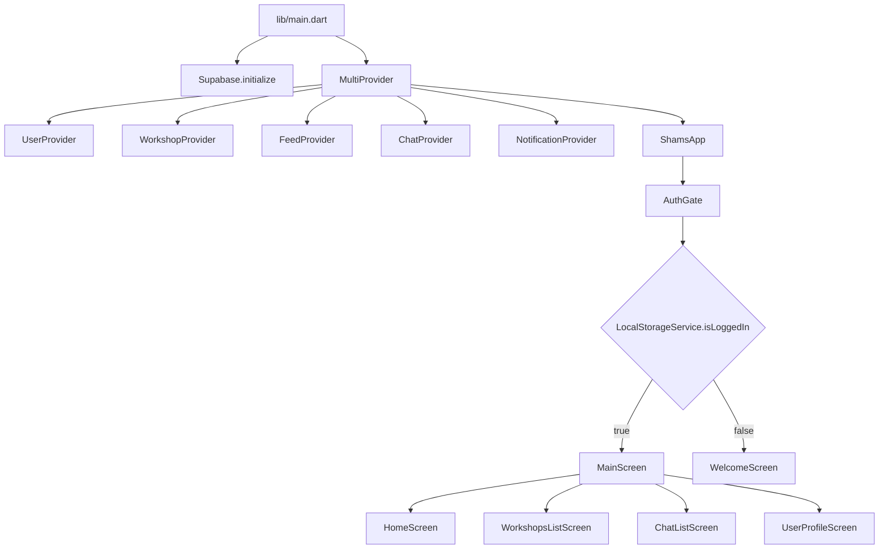

## التقنيات المستخدمة

| التقنية | مكانها | وظيفتها |
|---|---|---|
| Flutter وDart | `lib/` وكل مجلدات المنصات | بناء التطبيق متعدد المنصات. |
| Material 3 | `lib/utils/theme.dart` | نظام واجهة موحد وألوان وخطوط. |
| Provider | `lib/main.dart`, `lib/providers/` | إدارة الحالة وإعادة بناء الواجهات عبر `context.watch` و`notifyListeners`. |
| Supabase Flutter | `main.dart`, `services/`, بعض `views/` | Auth، قاعدة بيانات PostgreSQL، Storage، Realtime، RPC. |
| Supabase Storage | `StorageService`, شاشات التسجيل/تعديل الملف | رفع صور الورش والمنشورات والصور الشخصية. |
| Supabase Realtime | `ChatService`, `NotificationService` | استقبال الرسائل والإشعارات لحظيًا. |
| Shared Preferences | `LocalStorageService`, `AuthGate` | حفظ حالة تسجيل الدخول محليًا. |
| image_picker | شاشات الملف والورش والمنشورات | اختيار صور من الجهاز أو الكاميرا. |
| google_fonts | `theme.dart` ومعظم الواجهات | استخدام خط Tajawal للواجهة العربية. |
| url_launcher | `UserProfileScreen`, `ShamsDrawer` | فتح روابط الدعم والهاتف/واتساب ونحوها. |
| share_plus | `UserProfileScreen` | مشاركة التطبيق أو بياناته. |
| timeago | `ChatListScreen`, `CommentsComponent` | عرض زمن نسبي في المحادثات والتعليقات. |
| Gradle Kotlin DSL | `android/*.kts` | بناء نسخة Android. |
| Xcode project files | `ios/`, `macos/` | بناء iOS وmacOS. |
| CMake وC++ runners | `linux/`, `windows/` | بناء Linux وWindows. |
| SQL/RLS | `supabase_*.sql` | سياسات أمان وإعدادات محادثات وإشعارات Supabase. |

## طبقات التطبيق

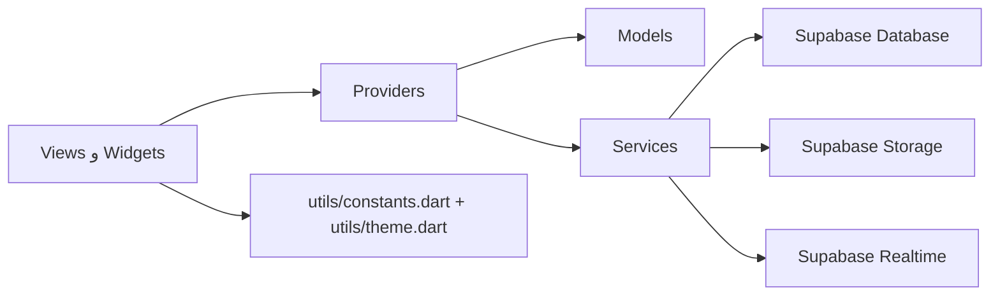

الواجهات لا يفترض أن تعرف تفاصيل جداول Supabase في أغلب الحالات. مثلًا `HomeScreen` لا تجلب المنشورات بنفسها، بل تقرأ `FeedProvider.posts`. المزود `FeedProvider` يستدعي `PostService.fetchFeed`، ثم يحول النتائج إلى `PostModel`. بعد التحديث ينادي `notifyListeners`، فتتحدث الواجهة التي تستخدم `context.watch<FeedProvider>()`.

هناك بعض الاستثناءات العملية:

- شاشات المصادقة تستخدم `Supabase.instance.client.auth` مباشرة لأنها تتعامل مع Auth مباشرة.
- `EditProfileScreen` و`SignUpProfileScreen` ترفعان صور الملف الشخصي وتحدثان `profiles` مباشرة.
- `NotificationsScreen` تستعلم مباشرة عن `chats` عند فتح إشعار طلب صيانة للوصول إلى المحادثة المرتبطة.
- `WorkshopProvider.fetchMyWorkshop` يجلب الورشة الخاصة مباشرة من Supabase بدل استخدام `WorkshopService.fetchMyWorkshop`.

هذه الاستثناءات لا تكسر التطبيق، لكنها تعني أن طبقة الخدمات ليست المصدر الوحيد للوصول إلى Supabase.

## تدفق التشغيل

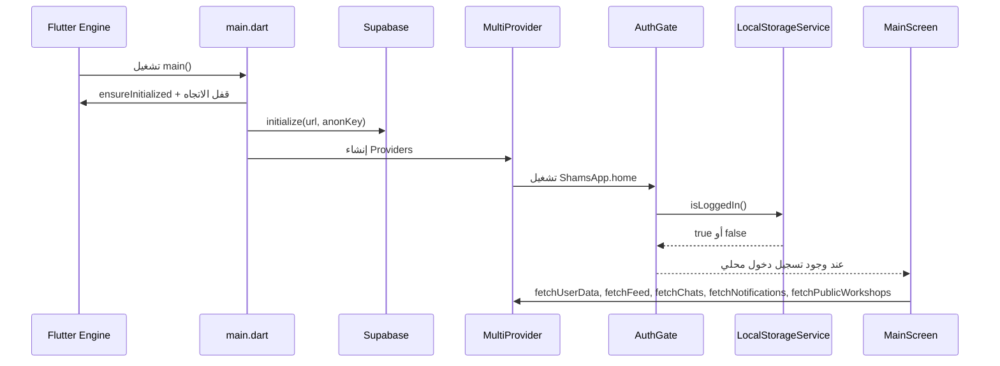

## تدفق البيانات العام

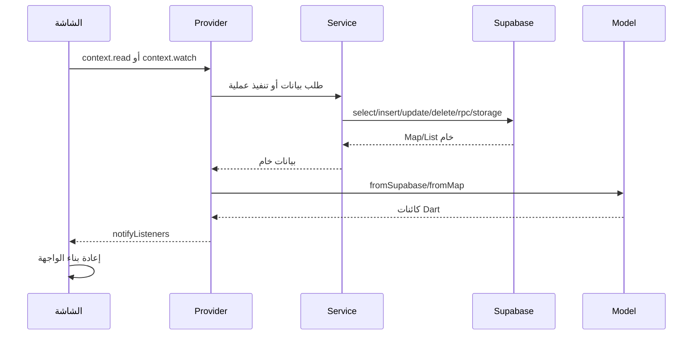

## تدفقات رئيسية داخل التطبيق

### تسجيل الدخول والتسجيل

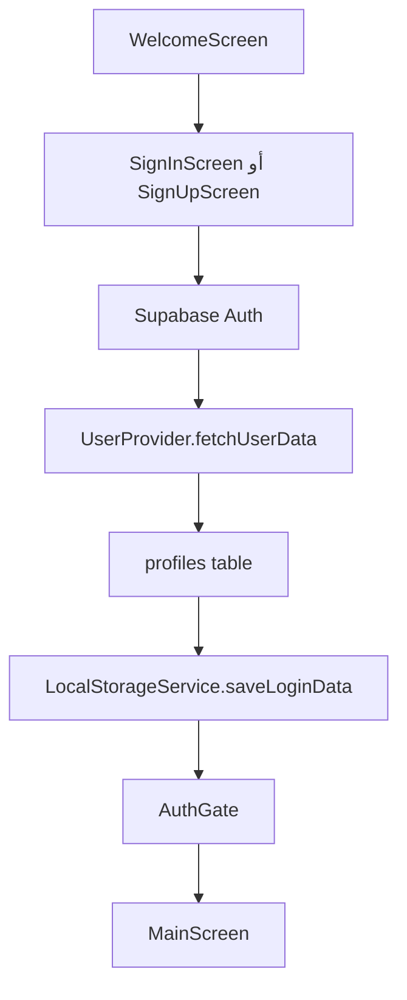

- `SignInScreen` يسجل الدخول بالبريد وكلمة المرور أو Google OAuth، ثم يجلب بيانات المستخدم ويحفظ حالة الدخول محليًا.
- `SignUpScreen` يتحقق من البريد وكلمة المرور ثم ينتقل إلى `SignUpProfileScreen`.
- `SignUpProfileScreen` ينشئ حساب Supabase Auth، يرفع الصورة إلى bucket `avatars` إن وجدت، ثم ينشئ سجلًا في جدول `profiles`.
- `AuthGate` يعتمد على `SharedPreferences` لا على جلسة Supabase مباشرة، لذلك الخروج يجب أن يمسح التخزين المحلي ويعمل `signOut`.

### عرض المنشورات والتفاعل معها

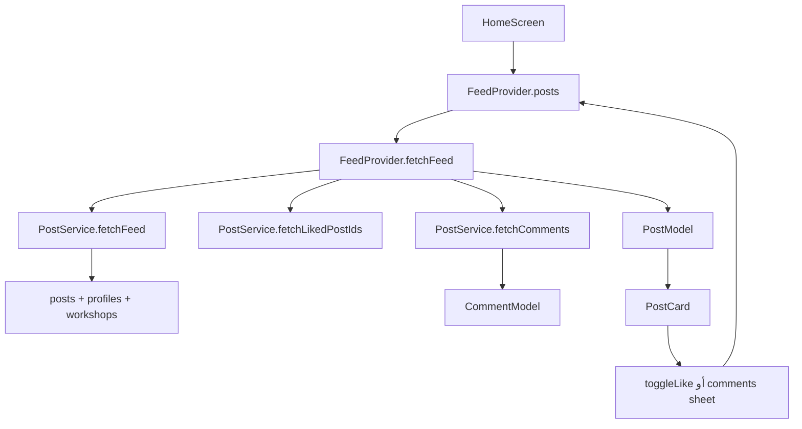

- `PostCard` يعرض بيانات المنشور، الصور، عدد الإعجابات والتعليقات.
- عند الإعجاب، `FeedProvider.toggleLike` يحدث الحالة محليًا أولًا ثم يستدعي `PostService.toggleLike`. لو فشل Supabase يرجع الحالة السابقة.
- التعليقات تفتح عبر `CommentsComponent` أو من `PostDetailScreen`، وتستخدم `FeedProvider.addComment/deleteComment/toggleCommentLike`.

### إنشاء وتعديل منشور

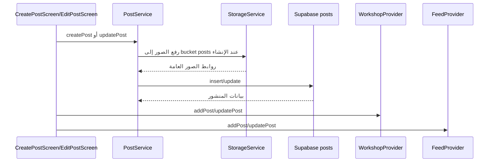

الربط بين `CreatePostScreen` وكل من `WorkshopProvider` و`FeedProvider` سببه أن المنشور الجديد يظهر في مكانين: لوحة الورشة الخاصة، والتغذية العامة.

### الورش والمتابعة

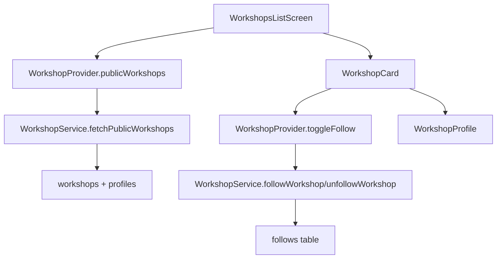

- `WorkshopProvider` يحتفظ بقائمتين: `publicWorkshops` للعرض العام، و`myWorkshop` مع `posts` للوحة صاحب الورشة.
- `WorkshopService` يرفع صور الورشة إلى bucket `workshops` ثم ينشئ سجلًا في `workshops`.
- `AddWorkshopScreen` ينشئ الورشة، ثم يحدث `WorkshopProvider.setMyWorkshop` و`UserProvider.updateWorkshopStatus(true)`.

### طلب الصيانة والمحادثة

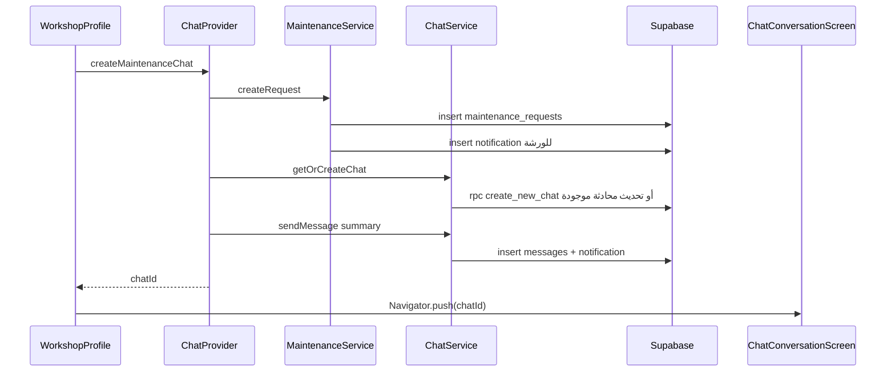

السبب في استخدام RPC `create_new_chat` هو إنشاء المحادثة والمشاركين بشكل ذري مع تجاوز تعقيدات RLS عند الإنشاء.

### الإشعارات

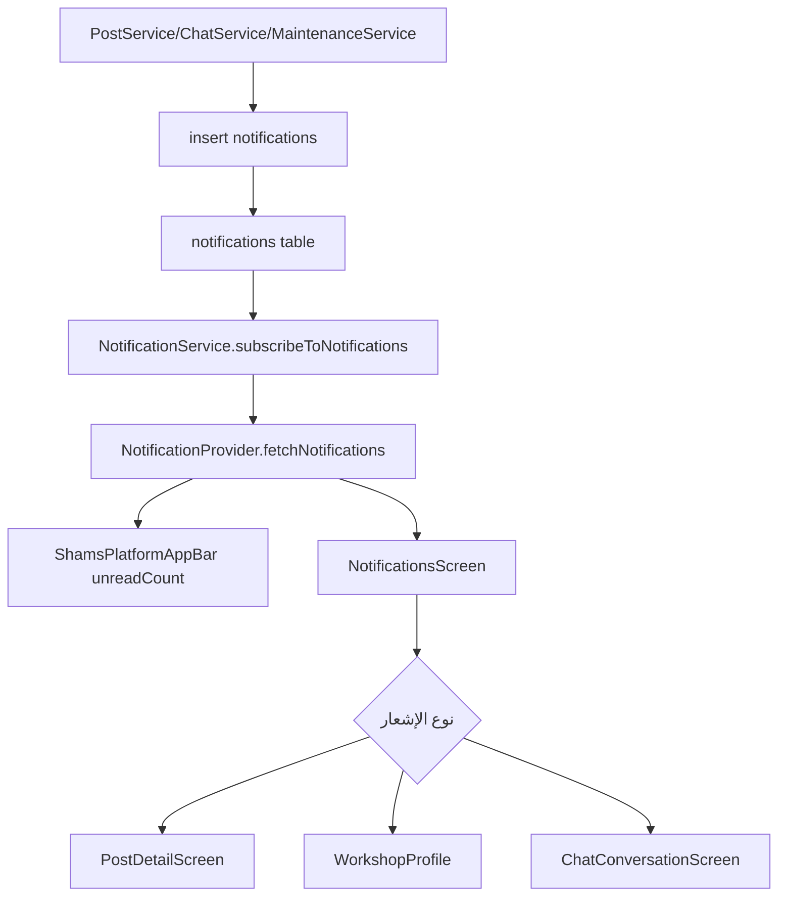

ملف `supabase_notifications_setup.sql` يقدم خيارين: السماح بالإدراج من جهة العميل، أو تحويل إنشاء الإشعارات إلى Triggers في قاعدة البيانات. الكود الحالي يستخدم الإدراج من جهة Flutter، لذلك تفعيل Triggers بدون تعديل الكود قد يؤدي إلى إشعارات مكررة.

## جداول Supabase المستنتجة من الكود

هذه العلاقات مستنتجة من استعلامات Dart وملفات SQL الموجودة:

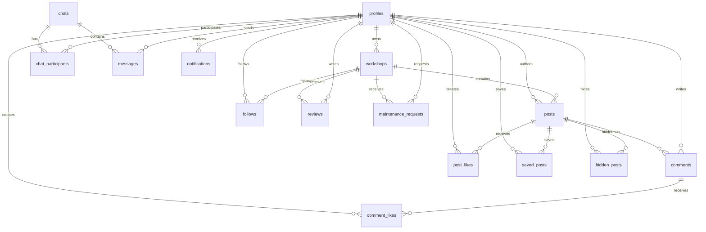

الجداول أو الـ buckets المستخدمة:

| النوع | الاسم | الاستخدام |
|---|---|---|
| Table | `profiles` | بيانات المستخدمين المرتبطة بـ Supabase Auth. |
| Table | `workshops` | بيانات الورش: الاسم، المدينة، الصور، الخدمات، التقييم. |
| Table | `posts` | منشورات الورش وصورها وعدد المشاهدات والإعجابات. |
| Table | `comments` | تعليقات المنشورات. |
| Table | `post_likes` | علاقة إعجاب المستخدم بمنشور. |
| Table | `comment_likes` | علاقة إعجاب المستخدم بتعليق. |
| Table | `hidden_posts` | منشورات أخفاها مستخدم معين من تغذيته. |
| Table | `saved_posts` | منشورات محفوظة. |
| Table | `follows` | متابعة المستخدمين للورش. |
| Table | `reviews` | تقييمات الورش. |
| Table | `chats` | المحادثات، وقد ترتبط بطلب صيانة. |
| Table | `chat_participants` | المستخدمون المشاركون في كل محادثة. |
| Table | `messages` | رسائل المحادثات. |
| Table | `maintenance_requests` | طلبات الصيانة/الخدمة. |
| Table | `notifications` | إشعارات المستخدمين. |
| Storage bucket | `avatars` | صور المستخدمين. |
| Storage bucket | `workshops` | شعار وغلاف ومعرض الورشة. |
| Storage bucket | `posts` | صور المنشورات. |

## هيكلية المجلدات

| المجلد | وظيفته |
|---|---|
| `.antigravitycli/` | بيانات أداة محلية، وليست جزءًا من منطق التطبيق. |
| `.dart_tool/` | ملفات مولدة من Flutter/Dart، لا تعدل يدويًا. |
| `.git/` | مستودع Git المحلي. |
| `.idea/` | إعدادات IntelliJ/Android Studio. |
| `.vscode/` | إعدادات VS Code. |
| `android/` | مشروع Android الأصلي، Manifest، Gradle، Kotlin runner، الأيقونات والأنماط. |
| `assets/` | صور وشعارات التطبيق المسجلة في `pubspec.yaml` أو الموجودة للاستخدام لاحقًا. |
| `build/` | مخرجات البناء المولدة. لا يعتمد عليها كمصدر. |
| `ios/` | مشروع iOS الأصلي، Xcode، Swift runner، Info.plist، storyboards، الأيقونات. |
| `lib/` | كود Flutter/Dart الأساسي. |
| `lib/models/` | نماذج البيانات وتحويلاتها. |
| `lib/providers/` | إدارة الحالة للبيانات الحية في التطبيق. |
| `lib/services/` | طبقة التعامل مع Supabase والتخزين المحلي. |
| `lib/utils/` | الثوابت والثيم. |
| `lib/views/` | الشاشات الكاملة ومسارات التطبيق. |
| `lib/widgets/` | مكونات واجهة قابلة لإعادة الاستخدام. |
| `linux/` | Runner وبناء Linux عبر CMake. |
| `macos/` | Runner وبناء macOS عبر Xcode/Swift. |
| `test/` | مجلد الاختبارات، وهو فارغ حاليًا. |
| `web/` | ملفات تشغيل Flutter Web والـ manifest والأيقونات. |
| `windows/` | Runner وبناء Windows عبر CMake/C++. |

## ملفات الجذر

| الملف | وظيفته |
|---|---|
| `.flutter-plugins-dependencies` | ملف يولده Flutter لتتبع إضافات المنصات وربطها. |
| `.gitignore` | يحدد الملفات والمجلدات التي لا تدخل Git مثل `build/` و`.dart_tool/`. |
| `.metadata` | معلومات Flutter عن المشروع والمنصات. |
| `analysis.txt` | مخرجات تحليل/ملاحظات قديمة محفوظة يدويًا. |
| `analyze_output.txt` | مخرجات `flutter analyze` أو تحليل مشابه محفوظة. |
| `fresh_analysis.txt` | تقرير تحليل آخر محفوظ في الجذر. |
| `analysis_options.yaml` | قواعد Dart analyzer، يستخدم `flutter_lints`. |
| `devtools_options.yaml` | إعدادات Flutter DevTools. |
| `pubspec.yaml` | تعريف المشروع والاعتمادات والأصول. |
| `pubspec.lock` | تثبيت الإصدارات الدقيقة للحزم. |
| `README.md` | وصف عام للمشروع، لكنه غير مطابق بالكامل للبنية الحالية. |
| `shams_mobile_app.iml` | ملف مشروع IntelliJ/Android Studio. |
| `supabase_chats_setup.sql` | دوال وسياسات RLS للمحادثات والرسائل والمشاركين. |
| `supabase_notifications_setup.sql` | سياسات RLS للإشعارات وخيارات Triggers. |
| `PROJECT_STRUCTURE_AR.md` | هذا الملف، توثيق الهيكلية والتدفقات. |

## ملفات lib

### نقطة الدخول

| الملف | وظيفته وروابطه |
|---|---|
| `lib/main.dart` | نقطة تشغيل التطبيق. يهيئ Supabase، يحدد الثيم واللغة العربية واتجاه RTL عبر localization delegates، ثم يحقن `WorkshopProvider`, `UserProvider`, `FeedProvider`, `ChatProvider`, `NotificationProvider`. يرتبط بـ `widgets/auth_gate.dart` لأنه يحدد شاشة البداية. |

### utils

| الملف | وظيفته وروابطه |
|---|---|
| `lib/utils/constants.dart` | مصدر مركزي للألوان `ShamsColors` والقوائم الدومينية مثل المحافظات اليمنية وأنواع خدمات الطاقة الشمسية وأنواع البطاريات والعواكس. تستخدمه معظم الشاشات والودجت لتوحيد النصوص والألوان. |
| `lib/utils/theme.dart` | يبني `ShamsTheme.light` باستخدام Material 3 وخط Tajawal. يرتبط بـ `constants.dart` ليستخدم ألوان العلامة، ويرتبط بـ `main.dart` عبر `theme: ShamsTheme.light`. |

### models

| الملف | النموذج | وظيفته وروابطه |
|---|---|---|
| `lib/models/user_model.dart` | `UserModel` | يمثل سجل المستخدم من `profiles` وبيانات الجلسة. تستخدمه معظم النماذج والشاشات. |
| `lib/models/post_model.dart` | `PostModel` | يمثل المنشور، ويرتبط بـ `UserModel` للمؤلف و`CommentModel` للتعليقات. يحول بيانات `posts` عبر `fromSupabase`. |
| `lib/models/comment_model.dart` | `CommentModel` | يمثل تعليقًا على منشور، ويرتبط بـ `UserModel` لصاحب التعليق. |
| `lib/models/public_workshop_model.dart` | `PublicWorkshopModel` | يمثل ورشة معروضة للعامة. يحتوي منشورات وتقييمات، ويستطيع التحول إلى `UserModel` لاستخدام الورشة كمشارك في محادثة. |
| `lib/models/workshop_data.dart` | `WorkshopData` | يمثل بيانات الورشة الخاصة بصاحبها، خاصة أثناء الإنشاء أو التعديل، ويدعم الصور المحلية و روابط الصور المرفوعة. |
| `lib/models/review_model.dart` | `ReviewModel` | يمثل تقييم ورشة ويرتبط بـ `UserModel` للمراجع. |
| `lib/models/chat_model.dart` | `ChatModel` | يمثل محادثة، ويرتبط بقائمة `UserModel` للمشاركين وقائمة `MessageModel` للرسائل. |
| `lib/models/message_model.dart` | `MessageModel` | يمثل رسالة واحدة من جدول `messages`. |
| `lib/models/notification_model.dart` | `NotificationModel`, `NotificationType` | يمثل إشعارًا ونوعه، ويحدد أيقونة ولونًا ومسار تنقل حسب النوع. |
| `lib/models/maintenance_request_model.dart` | `MaintenanceRequestModel`, `MaintenanceRequestStatus` | يمثل طلب صيانة من عميل إلى ورشة، مع ملخص نصي وحالات الطلب. |

### providers

| الملف | وظيفته وروابطه |
|---|---|
| `lib/providers/user_provider.dart` | يحتفظ بـ `currentUser`. يجلب أو ينشئ سجل `profiles` للمستخدم الحالي، ويحدث بيانات الملف ويصفيها عند الخروج. يرتبط مباشرة بـ Supabase Auth و`UserModel`. |
| `lib/providers/workshop_provider.dart` | يدير `publicWorkshops`, `myWorkshop`, ومنشورات صاحب الورشة. يستدعي `WorkshopService` و`PostService`، ويستخدم `PublicWorkshopModel`, `WorkshopData`, `PostModel`, `CommentModel`. |
| `lib/providers/feed_provider.dart` | يدير التغذية العامة `posts`. يستدعي `PostService` لجلب المنشورات والتعليقات والإعجابات، ويحدث الواجهة عبر `notifyListeners`. |
| `lib/providers/chat_provider.dart` | يدير قائمة المحادثات ويربط طلبات الصيانة بالمحادثة. يستخدم `ChatService`, `MaintenanceService`, `ChatModel`, `MessageModel`, `UserModel`. |
| `lib/providers/notification_provider.dart` | يدير قائمة الإشعارات والاشتراك اللحظي، ويحسب `unreadCount` لشريط التطبيق. يستخدم `NotificationService` و`NotificationModel`. |

### services

| الملف | وظيفته وروابطه |
|---|---|
| `lib/services/supabase_service.dart` | مغلف بسيط للوصول إلى `Supabase.instance.client` و`currentUserId`. موجود كاختصار، لكن معظم الكود يستخدم Supabase مباشرة. |
| `lib/services/local_storage_service.dart` | يستخدم `SharedPreferences` لحفظ حالة الدخول والبريد ومسحها. يرتبط بـ `AuthGate`, `SignInScreen`, `UserProfileScreen`, `ShamsDrawer`. |
| `lib/services/storage_service.dart` | يرفع ويحذف صورًا من Supabase Storage ويعيد URL عام. تستخدمه خدمات المنشورات والورش. |
| `lib/services/workshop_service.dart` | CRUD للورش: إنشاء، جلب، تحديث، حذف، متابعة/إلغاء متابعة. يستخدم `StorageService` عند إنشاء الورشة. |
| `lib/services/post_service.dart` | CRUD للمنشورات، جلب التغذية، إخفاء/حفظ، إعجابات وتعليقات. يستخدم `StorageService` لصور المنشورات وينشئ إشعارات إعجاب. |
| `lib/services/chat_service.dart` | إنشاء/جلب المحادثات، إرسال الرسائل، تعليمها كمقروءة، حذفها، والاشتراك اللحظي في الرسائل. يستخدم RPC `create_new_chat`. |
| `lib/services/maintenance_service.dart` | إنشاء طلب صيانة، جلب طلبات العميل أو الورشة، تحديث الحالة، حذف الطلب، وإنشاء إشعارات مرتبطة. |
| `lib/services/notification_service.dart` | جلب الإشعارات وتحديثها وحذفها والاشتراك اللحظي في إدراج إشعارات جديدة. |
| `lib/services/review_service.dart` | CRUD لتقييمات الورش. |

### views

| الملف | وظيفته وروابطه |
|---|---|
| `lib/views/main_screen.dart` | حاوية التبويبات الأساسية. يستخدم `IndexedStack` مع الصفحة الرئيسية والورش والمحادثات والملف الشخصي. عند البدء يجلب بيانات المستخدم والتغذية والورش والإشعارات والمحادثات. |
| `lib/views/home.dart` | شاشة التغذية الرئيسية. تقرأ `FeedProvider` وتعرض `PostCard`، وتفتح `PostDetailScreen`, `CommentsComponent`, `WorkshopProfile`, و`NotificationsScreen`. |
| `lib/views/auth/welcome.dart` | شاشة ترحيب تربط المستخدم بشاشتي التسجيل والدخول. |
| `lib/views/auth/signin.dart` | تسجيل الدخول بالبريد أو Google OAuth. يرتبط بـ Supabase Auth، `UserProvider`, `LocalStorageService`, و`AuthGate`. |
| `lib/views/auth/signup.dart` | خطوة إدخال البريد وكلمة المرور، ثم الانتقال إلى `SignUpProfileScreen`. يستمع لتغير حالة Auth. |
| `lib/views/auth/signup_profile_screen.dart` | إكمال بيانات الحساب: الاسم، اسم المستخدم، الهاتف، الصورة. ينشئ حساب Supabase، يرفع avatar، ويضيف سجل `profiles`. |
| `lib/views/workshops/workshops_list_screen.dart` | قائمة الورش. تقرأ `WorkshopProvider.publicWorkshops`، تستخدم `CityMultiSelectFilter` و`WorkshopCard`، وتفتح `WorkshopProfile`. |
| `lib/views/workshops/workshop_profile_screen.dart` | صفحة ورشة عامة: الغلاف، المتابعة، الخدمات، المنشورات، وطلب الصيانة. تستخدم `WorkshopProvider`, `ChatProvider`, `UserProvider`, `FeedProvider`. |
| `lib/views/workshops/workshop_dashboard_screen.dart` | لوحة صاحب الورشة: تعديل بيانات الورشة وصورها، عرض/حذف/تعديل المنشورات، وفتح إنشاء منشور. تستخدم `WorkshopService`, `StorageService`, `WorkshopProvider`. |
| `lib/views/workshops/create_post_screen.dart` | إنشاء منشور جديد مع صور. يستخدم `ImagePicker`, `PostService`, ثم يحدث `WorkshopProvider` و`FeedProvider`. |
| `lib/views/workshops/edit_post_screen.dart` | تعديل نص/تمييز منشور موجود وإدارة المرفقات محليًا. يستدعي `PostService.updatePost` ثم يحدث المزودين. |
| `lib/views/posts/post_detail_screen.dart` | تفاصيل منشور واحد مع التعليقات والإعجابات. يقرأ المنشور مباشرة من `FeedProvider` لضمان تحديث حي. |
| `lib/views/chat/chat_list_screen.dart` | صندوق المحادثات. يقرأ `ChatProvider`, `UserProvider`, `WorkshopProvider` لعرض الطرف الآخر وربط الورشة بالمحادثة. |
| `lib/views/chat/chat_conversation_screen.dart` | شاشة الرسائل داخل محادثة. تشترك في رسائل Supabase Realtime عبر `ChatService.subscribeToMessages` وتستخدم `ChatProvider.sendMessage`. |
| `lib/views/notifications/notifications_screen.dart` | قائمة الإشعارات. تستخدم `NotificationProvider` وتفتح الوجهة المناسبة حسب `NotificationType`. |
| `lib/views/user_profile/user_profile_screen.dart` | صفحة المستخدم: بياناته، مشاركة، دعم، فتح لوحة الورشة أو إنشائها، وتسجيل الخروج مع تنظيف كل المزودين. |
| `lib/views/user_profile/edit_profile_screen.dart` | تعديل بيانات المستخدم وصورته. يستخدم `ImagePicker`, Supabase Storage bucket `avatars`, وتحديث `profiles` ثم `UserProvider`. |
| `lib/views/user_profile/add_workshop_screen.dart` | إنشاء ورشة جديدة. يستخدم `WorkshopService.createWorkshop`, ثم يحدث `WorkshopProvider` و`UserProvider`. |
| `lib/views/user_profile/privacy_security_screen.dart` | شاشة إعدادات خصوصية وأمان ثابتة بصريًا. |
| `lib/views/user_profile/about_shams_screen.dart` | شاشة معلومات عن منصة شمس. |

### widgets

| الملف | وظيفته وروابطه |
|---|---|
| `lib/widgets/auth_gate.dart` | بوابة البداية. تقرأ `LocalStorageService.isLoggedIn` وتختار `MainScreen` أو `WelcomeScreen`. |
| `lib/widgets/appbar.dart` | شريط تطبيق موحد مع شارة عدد الإشعارات غير المقروءة من `NotificationProvider`. |
| `lib/widgets/shams_bottom_nav_bar.dart` | شريط تنقل سفلي مخصص يستخدمه `MainScreen`. |
| `lib/widgets/shams_drawer.dart` | قائمة جانبية للتنقل والدعم وتسجيل الخروج. تنظف `UserProvider`, `NotificationProvider`, `ChatProvider`, `FeedProvider` وتعمل Supabase signOut. |
| `lib/widgets/post_card.dart` | بطاقة منشور تفاعلية للصور والنص والإعجاب والتعليقات والقائمة. تستخدمها الرئيسية والتفاصيل. |
| `lib/widgets/managed_post_card.dart` | بطاقة منشور خاصة بإدارة منشورات صاحب الورشة في لوحة الورشة. |
| `lib/widgets/comments_component.dart` | Bottom sheet للتعليقات. يقرأ `FeedProvider` ويضيف/يحذف/يعجب بالتعليقات. |
| `lib/widgets/comment_tile.dart` | عنصر تعليق صغير قابل لإعادة الاستخدام. |
| `lib/widgets/workshop_card.dart` | بطاقة ورشة في القائمة، مع متابعة ودخول للملف. |
| `lib/widgets/city_filter.dart` | اختيار متعدد للمحافظات، يعتمد على `ShamsConstants.yemeniCities`. |
| `lib/widgets/chat_tile.dart` | عنصر محادثة في قائمة الرسائل. |
| `lib/widgets/message_bubble.dart` | فقاعة رسالة داخل المحادثة. |
| `lib/widgets/chat_input_field.dart` | حقل إدخال الرسالة وزر الإرسال. |
| `lib/widgets/inline_search_bar.dart` | شريط بحث مدمج في الشاشات. |
| `lib/widgets/search_bar.dart` | `SearchDelegate` مخصص لبحث الاقتراحات. |
| `lib/widgets/text_field.dart` | حقل نص موحد مع دعم إظهار/إخفاء كلمة المرور. |
| `lib/widgets/username_field.dart` | حقل اسم مستخدم مع `UsernameValidator`. |
| `lib/widgets/primary_button.dart` | زر أساسي موحد. |
| `lib/widgets/outlined_button.dart` | زر بإطار موحد. |
| `lib/widgets/scrollable_image_picker.dart` | شريط صور أفقي مع زر إضافة وحذف. |
| `lib/widgets/image_source_sheet.dart` | Bottom sheet لاختيار مصدر الصورة: كاميرا أو معرض. |

## روابط الملفات ولماذا تم الربط

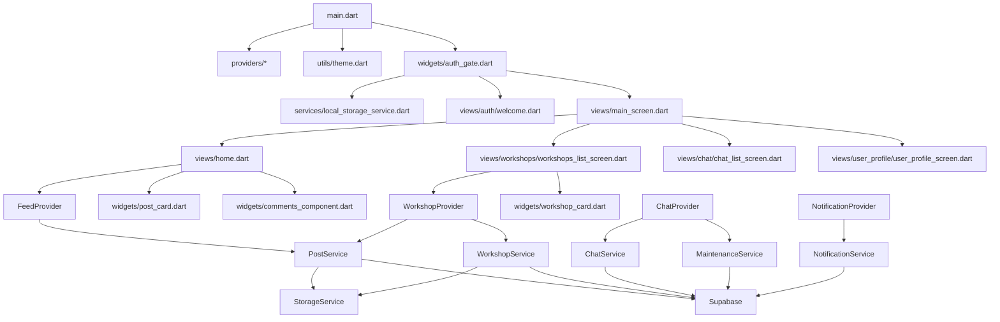

أسباب الربط الرئيسية:

- `main.dart` يرتبط بكل Provider لأن التطبيق يحتاج حالة عامة مشتركة بين الشاشات.
- `AuthGate` يرتبط بـ `LocalStorageService` لأنه يقرر أول شاشة من حالة الدخول المحفوظة محليًا.
- `MainScreen` يرتبط بالصفحات الأربع لأنه هو مدير التبويبات.
- `HomeScreen` يرتبط بـ `FeedProvider` لأن التغذية يجب أن تتحدث عند الإعجاب والتعليق.
- `WorkshopProfile` يرتبط بـ `ChatProvider` لأن زر طلب الصيانة يحتاج إنشاء محادثة مرتبطة بورشة.
- `CreatePostScreen` يرتبط بـ `PostService` للحفظ في Supabase، وبـ `WorkshopProvider/FeedProvider` لتحديث الواجهة فورًا.
- `ChatConversationScreen` يستخدم `ChatService.subscribeToMessages` لأن الرسائل تحتاج تحديثًا لحظيًا، ويستخدم `ChatProvider` لإدارة القائمة المحلية.
- `ShamsPlatformAppBar` يرتبط بـ `NotificationProvider` لعرض عدد الإشعارات غير المقروءة في كل شاشة تستخدمه.

## تفاصيل أصول الصور

| الملف | الاستخدام |
|---|---|
| `assets/images/post image.jpg` | صورة افتراضية للمنشورات أو غلاف الورشة. |
| `assets/images/logo/shams logo.png` | شعار افتراضي مستخدم في النماذج والواجهات. |
| `assets/images/logo/shams texial logo light mode.png` | شعار نصي للوضع الفاتح، مسجل في `pubspec.yaml`. |
| `assets/images/logo/shams texial logo for light mode.png` | شعار نصي للوضع الفاتح، مسجل في `pubspec.yaml`. |
| `assets/images/logo/shams texial logo for light mode small height.png` | نسخة قصيرة الارتفاع من الشعار، مسجلة في `pubspec.yaml`. |
| `assets/images/logo/shams texial logo for dark mode.png` | موجود في المجلد لكنه غير مسجل ضمن `assets` في `pubspec.yaml` حاليًا. |

## ملفات إعداد المنصات

### Android

| الملف | وظيفته |
|---|---|
| `android/settings.gradle.kts` | إعداد مشروع Gradle وربط تطبيق Android. |
| `android/build.gradle.kts` | مستودعات Gradle، مسار build مخصص، ومهام clean. |
| `android/gradle.properties` | إعداد ذاكرة Gradle، AndroidX، وتعطيل بعض خصائص Gradle. |
| `android/gradle/wrapper/gradle-wrapper.properties` | إصدار ومصدر Gradle Wrapper. |
| `android/app/build.gradle.kts` | إعداد التطبيق: namespace, applicationId, SDK, Java/Kotlin 17, وربط Flutter source. |
| `android/app/src/main/AndroidManifest.xml` | تعريف Activity، Flutter embedding، deep link `shams://login-callback`، وصلاحيات الصور. |
| `android/app/src/debug/AndroidManifest.xml` | Manifest خاص بوضع debug. |
| `android/app/src/profile/AndroidManifest.xml` | Manifest خاص بوضع profile. |
| `android/app/src/main/kotlin/com/example/shams_mobile_app/MainActivity.kt` | نقطة دخول Android التي ترث `FlutterActivity`. |
| `android/app/src/main/res/values/styles.xml` | أنماط Android الافتراضية. |
| `android/app/src/main/res/values-night/styles.xml` | أنماط الوضع الليلي. |
| `android/app/src/main/res/drawable/launch_background.xml` | خلفية الإقلاع قبل ظهور Flutter. |
| `android/app/src/main/res/drawable-v21/launch_background.xml` | خلفية إقلاع لإصدارات Android الحديثة. |
| `android/app/src/main/res/mipmap-*/ic_launcher.png` | أيقونات التطبيق لمختلف كثافات الشاشة. |
| `android/build/reports/problems/problems-report.html` | تقرير مشاكل Gradle مولد، وليس جزءًا من منطق التطبيق. |

ملاحظة: `applicationId` الحالي هو `com.example.shams_mobile_app`، وينبغي تغييره قبل النشر الرسمي.

### iOS

| الملف | وظيفته |
|---|---|
| `ios/Flutter/AppFrameworkInfo.plist` | معلومات إطار Flutter لـ iOS. |
| `ios/Flutter/Debug.xcconfig` | إعدادات بناء debug. |
| `ios/Flutter/Release.xcconfig` | إعدادات بناء release. |
| `ios/Runner/AppDelegate.swift` | نقطة دخول iOS لتشغيل Flutter. |
| `ios/Runner/SceneDelegate.swift` | إدارة مشهد iOS وربط النافذة. |
| `ios/Runner/Runner-Bridging-Header.h` | جسر Swift/Objective-C. |
| `ios/Runner/Info.plist` | اسم التطبيق، النسخة، الاتجاهات، storyboards. |
| `ios/Runner/Base.lproj/Main.storyboard` | storyboard الرئيسي. |
| `ios/Runner/Base.lproj/LaunchScreen.storyboard` | شاشة الإقلاع. |
| `ios/Runner/Assets.xcassets/AppIcon.appiconset/*` | أيقونات التطبيق بجميع الأحجام. |
| `ios/Runner/Assets.xcassets/LaunchImage.imageset/*` | صور الإقلاع وملف README الخاص بها. |
| `ios/Runner.xcodeproj/project.pbxproj` | ملف مشروع Xcode. |
| `ios/Runner.xcodeproj/project.xcworkspace/*` | إعدادات workspace الداخلية. |
| `ios/Runner.xcodeproj/xcshareddata/xcschemes/Runner.xcscheme` | مخطط بناء وتشغيل Runner. |
| `ios/Runner.xcworkspace/*` | ملفات workspace الرئيسي. |
| `ios/RunnerTests/RunnerTests.swift` | قالب اختبارات iOS. |

### macOS

| الملف | وظيفته |
|---|---|
| `macos/Flutter/GeneratedPluginRegistrant.swift` | تسجيل إضافات Flutter على macOS. |
| `macos/Flutter/Flutter-Debug.xcconfig` | إعدادات debug. |
| `macos/Flutter/Flutter-Release.xcconfig` | إعدادات release. |
| `macos/Runner/AppDelegate.swift` | نقطة دخول macOS. |
| `macos/Runner/MainFlutterWindow.swift` | نافذة Flutter الرئيسية. |
| `macos/Runner/Info.plist` | معلومات تطبيق macOS. |
| `macos/Runner/DebugProfile.entitlements` | صلاحيات debug/profile. |
| `macos/Runner/Release.entitlements` | صلاحيات release. |
| `macos/Runner/Configs/AppInfo.xcconfig` | معلومات التطبيق. |
| `macos/Runner/Configs/Debug.xcconfig` | إعدادات debug. |
| `macos/Runner/Configs/Release.xcconfig` | إعدادات release. |
| `macos/Runner/Configs/Warnings.xcconfig` | إعدادات التحذيرات. |
| `macos/Runner/Base.lproj/MainMenu.xib` | واجهة قائمة macOS. |
| `macos/Runner/Assets.xcassets/AppIcon.appiconset/*` | أيقونات macOS. |
| `macos/Runner.xcodeproj/project.pbxproj` | مشروع Xcode لـ macOS. |
| `macos/Runner.xcodeproj/project.xcworkspace/*` | إعدادات workspace. |
| `macos/Runner.xcodeproj/xcshareddata/xcschemes/Runner.xcscheme` | مخطط بناء Runner. |
| `macos/Runner.xcworkspace/*` | workspace الرئيسي. |
| `macos/RunnerTests/RunnerTests.swift` | قالب اختبارات macOS. |

### Linux

| الملف | وظيفته |
|---|---|
| `linux/CMakeLists.txt` | إعداد مشروع Linux، اسم التطبيق، GTK، Flutter assemble، وتثبيت الحزمة. |
| `linux/flutter/CMakeLists.txt` | إعداد Flutter managed build. |
| `linux/flutter/generated_plugin_registrant.cc` | تسجيل الإضافات C++. |
| `linux/flutter/generated_plugin_registrant.h` | تعريف تسجيل الإضافات. |
| `linux/flutter/generated_plugins.cmake` | قائمة إضافات Flutter على Linux. |
| `linux/runner/CMakeLists.txt` | إعداد runner الأصلي. |
| `linux/runner/main.cc` | نقطة دخول تطبيق Linux. |
| `linux/runner/my_application.cc` | تطبيق GTK الذي يستضيف Flutter. |
| `linux/runner/my_application.h` | تعريف تطبيق GTK. |

### Windows

| الملف | وظيفته |
|---|---|
| `windows/CMakeLists.txt` | إعداد مشروع Windows، Unicode، بناء Flutter، وتثبيت الملفات. |
| `windows/flutter/CMakeLists.txt` | إعداد Flutter managed build. |
| `windows/flutter/generated_plugin_registrant.cc` | تسجيل الإضافات C++. |
| `windows/flutter/generated_plugin_registrant.h` | تعريف تسجيل الإضافات. |
| `windows/flutter/generated_plugins.cmake` | قائمة إضافات Flutter على Windows. |
| `windows/runner/CMakeLists.txt` | إعداد runner الأصلي. |
| `windows/runner/main.cpp` | نقطة دخول Windows. |
| `windows/runner/flutter_window.cpp` | نافذة Flutter على Windows. |
| `windows/runner/flutter_window.h` | تعريف نافذة Flutter. |
| `windows/runner/win32_window.cpp` | نافذة Win32 الأساسية. |
| `windows/runner/win32_window.h` | تعريف Win32 window. |
| `windows/runner/utils.cpp` | دوال مساعدة لـ Windows runner. |
| `windows/runner/utils.h` | تعريف الدوال المساعدة. |
| `windows/runner/Runner.rc` | موارد Windows مثل الأيقونة والنسخة. |
| `windows/runner/runner.exe.manifest` | manifest التطبيق التنفيذي. |
| `windows/runner/resource.h` | معرفات الموارد. |
| `windows/runner/resources/app_icon.ico` | أيقونة تطبيق Windows. |

### Web

| الملف | وظيفته |
|---|---|
| `web/index.html` | صفحة HTML التي تحمل Flutter web عبر `flutter_bootstrap.js`. |
| `web/manifest.json` | إعداد PWA: الاسم، اللون، الأيقونات، واتجاه الشاشة. |
| `web/favicon.png` | أيقونة المتصفح. |
| `web/icons/Icon-192.png` | أيقونة PWA 192. |
| `web/icons/Icon-512.png` | أيقونة PWA 512. |
| `web/icons/Icon-maskable-192.png` | أيقونة maskable 192. |
| `web/icons/Icon-maskable-512.png` | أيقونة maskable 512. |

## ملفات إعداد المحررات والأدوات

| الملف | وظيفته |
|---|---|
| `.vscode/settings.json` | يجعل VS Code يسأل عند تحديث إعداد بناء Java/Gradle. |
| `.idea/modules.xml` | تعريف وحدات المشروع في IntelliJ. |
| `.idea/workspace.xml` | حالة workspace في IntelliJ. |
| `.idea/libraries/Dart_SDK.xml` | تعريف مكتبة Dart SDK. |
| `.idea/libraries/KotlinJavaRuntime.xml` | تعريف Kotlin/Java runtime. |
| `.idea/runConfigurations/main_dart.xml` | إعداد تشغيل `main.dart`. |
| `.antigravitycli/187869b5-7a16-4800-a353-e86a454c94ac.json` | ملف أداة محلية فارغ حاليًا. |

## ملاحظات مهمة على البنية

- لا يوجد مجلد `controllers/` في الكود الحالي. طبقة الحالة هي `providers/`.
- لا توجد اختبارات Dart فعلية داخل `test/` حاليًا.
- الاعتماد على `LocalStorageService.isLoggedIn` في `AuthGate` يعني أن حالة الدخول المحلية قد تختلف عن جلسة Supabase إن لم يتم مسحها أو مزامنتها بدقة.
- بعض الوصول إلى Supabase يتم مباشرة داخل الشاشات، خصوصًا المصادقة وتعديل الملف. لو أردت بنية أنظف مستقبلًا، يمكن نقل هذه العمليات إلى خدمات مخصصة مثل `AuthService` و`ProfileService`.
- ملف `supabase_notifications_setup.sql` يشرح خيار Triggers، لكن الكود الحالي ينشئ الإشعارات من جهة العميل، لذلك يجب اختيار مسار واحد لتجنب التكرار.
- صورة `assets/images/logo/shams texial logo for dark mode.png` موجودة لكنها غير مسجلة في `pubspec.yaml`.

## خلاصة الربط

الفكرة المركزية في المشروع أن `Provider` هو الجسر بين الواجهة والبيانات. الواجهة تعرض وتطلق الأحداث، المزود يقرر كيف تتغير الحالة، الخدمات تتكلم مع Supabase، والنماذج تجعل البيانات قابلة للاستخدام داخل Flutter. هذا الربط يعطي التطبيق تحديثات فورية نسبيًا، خصوصًا في الإعجاب والمتابعة والرسائل، مع دعم Realtime للمحادثات والإشعارات.

## ملحق: الفهرس الحرفي للملفات

هذا الفهرس يختصر وظيفة كل ملف ظاهر في المشروع المصدر والإعدادات. الملفات المولدة داخل `build/` و`.dart_tool/` لا تفصل هنا لأنها مخرجات بناء تتغير تلقائيًا، باستثناء تقرير Gradle الموجود ضمن `android/build/reports`.

### ملفات مخفية وإعدادات محلية

| الملف | الوظيفة المختصرة |
|---|---|
| `.flutter-plugins-dependencies` | خريطة إضافات Flutter لكل منصة، يولدها Flutter. |
| `.gitignore` | قواعد تجاهل Git. |
| `.metadata` | بيانات Flutter عن المشروع والمنصات المفعلة. |
| `.antigravitycli/187869b5-7a16-4800-a353-e86a454c94ac.json` | ملف أداة محلية فارغ حاليًا. |
| `.vscode/settings.json` | إعداد VS Code لتحديث إعداد Java/Gradle تفاعليًا. |
| `.idea/modules.xml` | تعريف وحدة المشروع في IntelliJ. |
| `.idea/workspace.xml` | حالة مساحة العمل في IntelliJ. |
| `.idea/libraries/Dart_SDK.xml` | ربط Dart SDK بالمشروع داخل IntelliJ. |
| `.idea/libraries/KotlinJavaRuntime.xml` | ربط Kotlin/Java runtime داخل IntelliJ. |
| `.idea/runConfigurations/main_dart.xml` | إعداد تشغيل `lib/main.dart`. |

### ملفات الجذر

| الملف | الوظيفة المختصرة |
|---|---|
| `analysis.txt` | تقرير تحليل محفوظ. |
| `analysis_options.yaml` | قواعد analyzer وحزمة lint. |
| `analyze_output.txt` | نتيجة تحليل محفوظة. |
| `devtools_options.yaml` | إعدادات DevTools. |
| `fresh_analysis.txt` | تقرير تحليل حديث محفوظ. |
| `PROJECT_STRUCTURE_AR.md` | توثيق بنية المشروع والتدفقات. |
| `pubspec.lock` | تثبيت إصدارات الحزم. |
| `pubspec.yaml` | تعريف المشروع والحزم والأصول. |
| `README.md` | وصف عام للمشروع. |
| `shams_mobile_app.iml` | ملف IntelliJ للمشروع. |
| `supabase_chats_setup.sql` | إعداد RLS ودوال المحادثات. |
| `supabase_notifications_setup.sql` | إعداد RLS وخيارات Triggers للإشعارات. |

### ملفات lib

| الملف | الوظيفة المختصرة |
|---|---|
| `lib/main.dart` | نقطة تشغيل Flutter وتهيئة Supabase وحقن Providers. |
| `lib/models/chat_model.dart` | نموذج محادثة ومشاركين ورسائل. |
| `lib/models/comment_model.dart` | نموذج تعليق منشور. |
| `lib/models/maintenance_request_model.dart` | نموذج طلب صيانة وحالاته. |
| `lib/models/message_model.dart` | نموذج رسالة داخل محادثة. |
| `lib/models/notification_model.dart` | نموذج إشعار ونوعه وأيقونته. |
| `lib/models/post_model.dart` | نموذج منشور وتحويله من Supabase. |
| `lib/models/public_workshop_model.dart` | نموذج ورشة عامة وتحويلها لمستخدم محادثة. |
| `lib/models/review_model.dart` | نموذج تقييم ورشة. |
| `lib/models/user_model.dart` | نموذج مستخدم. |
| `lib/models/workshop_data.dart` | نموذج بيانات الورشة الخاصة وصورها. |
| `lib/providers/chat_provider.dart` | حالة المحادثات والرسائل وطلبات الصيانة. |
| `lib/providers/feed_provider.dart` | حالة التغذية العامة والتعليقات والإعجابات. |
| `lib/providers/notification_provider.dart` | حالة الإشعارات والاشتراك اللحظي. |
| `lib/providers/user_provider.dart` | حالة المستخدم الحالي وملفه. |
| `lib/providers/workshop_provider.dart` | حالة الورش العامة وورشة المستخدم ومنشوراتها. |
| `lib/services/chat_service.dart` | عمليات Supabase للمحادثات والرسائل وRealtime. |
| `lib/services/local_storage_service.dart` | تخزين حالة الدخول محليًا. |
| `lib/services/maintenance_service.dart` | عمليات طلبات الصيانة وإشعاراتها. |
| `lib/services/notification_service.dart` | عمليات الإشعارات وRealtime. |
| `lib/services/post_service.dart` | عمليات المنشورات والتعليقات والإعجابات والحفظ والإخفاء. |
| `lib/services/review_service.dart` | عمليات تقييمات الورش. |
| `lib/services/storage_service.dart` | رفع وحذف الصور من Supabase Storage. |
| `lib/services/supabase_service.dart` | اختصار مركزي لعميل Supabase. |
| `lib/services/workshop_service.dart` | عمليات الورش والمتابعة. |
| `lib/utils/constants.dart` | ألوان وقوائم نطاق التطبيق. |
| `lib/utils/theme.dart` | ثيم Material 3 وخط Tajawal. |
| `lib/views/auth/signin.dart` | شاشة تسجيل الدخول. |
| `lib/views/auth/signup.dart` | شاشة بدء التسجيل بالبريد وكلمة المرور. |
| `lib/views/auth/signup_profile_screen.dart` | إكمال ملف المستخدم وإنشاء `profiles`. |
| `lib/views/auth/welcome.dart` | شاشة الترحيب والانتقال للدخول أو التسجيل. |
| `lib/views/chat/chat_conversation_screen.dart` | شاشة محادثة واحدة مع اشتراك Realtime. |
| `lib/views/chat/chat_list_screen.dart` | قائمة المحادثات. |
| `lib/views/home.dart` | التغذية الرئيسية. |
| `lib/views/main_screen.dart` | حاوية التبويبات الرئيسية. |
| `lib/views/notifications/notifications_screen.dart` | شاشة الإشعارات والتنقل حسب نوع الإشعار. |
| `lib/views/posts/post_detail_screen.dart` | تفاصيل منشور وتعليقاته. |
| `lib/views/user_profile/about_shams_screen.dart` | معلومات عن منصة شمس. |
| `lib/views/user_profile/add_workshop_screen.dart` | إنشاء ورشة للمستخدم. |
| `lib/views/user_profile/edit_profile_screen.dart` | تعديل بيانات وصورة المستخدم. |
| `lib/views/user_profile/privacy_security_screen.dart` | شاشة الخصوصية والأمان. |
| `lib/views/user_profile/user_profile_screen.dart` | ملف المستخدم وإعداداته وتسجيل الخروج. |
| `lib/views/workshops/create_post_screen.dart` | إنشاء منشور ورشة. |
| `lib/views/workshops/edit_post_screen.dart` | تعديل منشور ورشة. |
| `lib/views/workshops/workshop_dashboard_screen.dart` | لوحة إدارة الورشة. |
| `lib/views/workshops/workshop_profile_screen.dart` | ملف ورشة عام وطلب صيانة. |
| `lib/views/workshops/workshops_list_screen.dart` | قائمة الورش والبحث/الفلترة. |
| `lib/widgets/appbar.dart` | شريط تطبيق موحد مع عداد إشعارات. |
| `lib/widgets/auth_gate.dart` | بوابة اختيار شاشة البداية حسب التخزين المحلي. |
| `lib/widgets/chat_input_field.dart` | إدخال رسالة. |
| `lib/widgets/chat_tile.dart` | عنصر محادثة. |
| `lib/widgets/city_filter.dart` | فلتر محافظات متعدد. |
| `lib/widgets/comment_tile.dart` | عنصر تعليق بسيط. |
| `lib/widgets/comments_component.dart` | Bottom sheet للتعليقات. |
| `lib/widgets/image_source_sheet.dart` | اختيار مصدر صورة. |
| `lib/widgets/inline_search_bar.dart` | شريط بحث مدمج. |
| `lib/widgets/managed_post_card.dart` | بطاقة منشور إدارية. |
| `lib/widgets/message_bubble.dart` | فقاعة رسالة. |
| `lib/widgets/outlined_button.dart` | زر بإطار. |
| `lib/widgets/post_card.dart` | بطاقة منشور عامة. |
| `lib/widgets/primary_button.dart` | زر أساسي. |
| `lib/widgets/scrollable_image_picker.dart` | قائمة صور قابلة للتمرير. |
| `lib/widgets/search_bar.dart` | SearchDelegate مخصص. |
| `lib/widgets/shams_bottom_nav_bar.dart` | شريط تنقل سفلي. |
| `lib/widgets/shams_drawer.dart` | درج جانبي للتنقل والدعم والخروج. |
| `lib/widgets/text_field.dart` | حقل نص موحد. |
| `lib/widgets/username_field.dart` | حقل اسم مستخدم مع تحقق. |
| `lib/widgets/workshop_card.dart` | بطاقة ورشة. |

### assets

| الملف | الوظيفة المختصرة |
|---|---|
| `assets/images/post image.jpg` | صورة افتراضية للمنشورات أو الأغلفة. |
| `assets/images/logo/shams logo.png` | شعار افتراضي. |
| `assets/images/logo/shams texial logo for dark mode.png` | شعار نصي للوضع الداكن، غير مسجل حاليًا في `pubspec.yaml`. |
| `assets/images/logo/shams texial logo for light mode small height.png` | شعار نصي صغير للوضع الفاتح. |
| `assets/images/logo/shams texial logo for light mode.png` | شعار نصي للوضع الفاتح. |
| `assets/images/logo/shams texial logo light mode.png` | نسخة أخرى من شعار الوضع الفاتح. |

### Android

| الملف | الوظيفة المختصرة |
|---|---|
| `android/settings.gradle.kts` | إعداد Gradle للمشروع. |
| `android/build.gradle.kts` | إعداد بناء Android العام. |
| `android/gradle.properties` | خصائص Gradle/AndroidX. |
| `android/gradle/wrapper/gradle-wrapper.properties` | إعداد Gradle Wrapper. |
| `android/app/build.gradle.kts` | إعداد تطبيق Android. |
| `android/app/src/debug/AndroidManifest.xml` | Manifest خاص بـ debug. |
| `android/app/src/main/AndroidManifest.xml` | Manifest الرئيسي والصلاحيات والـ deep link. |
| `android/app/src/main/kotlin/com/example/shams_mobile_app/MainActivity.kt` | FlutterActivity لنقطة دخول Android. |
| `android/app/src/main/res/drawable/launch_background.xml` | خلفية إقلاع Android. |
| `android/app/src/main/res/drawable-v21/launch_background.xml` | خلفية إقلاع Android API 21+. |
| `android/app/src/main/res/mipmap-hdpi/ic_launcher.png` | أيقونة Android hdpi. |
| `android/app/src/main/res/mipmap-mdpi/ic_launcher.png` | أيقونة Android mdpi. |
| `android/app/src/main/res/mipmap-xhdpi/ic_launcher.png` | أيقونة Android xhdpi. |
| `android/app/src/main/res/mipmap-xxhdpi/ic_launcher.png` | أيقونة Android xxhdpi. |
| `android/app/src/main/res/mipmap-xxxhdpi/ic_launcher.png` | أيقونة Android xxxhdpi. |
| `android/app/src/main/res/values/styles.xml` | أنماط Android. |
| `android/app/src/main/res/values-night/styles.xml` | أنماط Android الليلية. |
| `android/app/src/profile/AndroidManifest.xml` | Manifest خاص بـ profile. |
| `android/build/reports/problems/problems-report.html` | تقرير مشاكل بناء مولد. |

### iOS

| الملف | الوظيفة المختصرة |
|---|---|
| `ios/Flutter/AppFrameworkInfo.plist` | معلومات Flutter framework. |
| `ios/Flutter/Debug.xcconfig` | إعداد debug. |
| `ios/Flutter/Release.xcconfig` | إعداد release. |
| `ios/Runner.xcodeproj/project.pbxproj` | مشروع Xcode. |
| `ios/Runner.xcodeproj/project.xcworkspace/contents.xcworkspacedata` | بيانات workspace داخل المشروع. |
| `ios/Runner.xcodeproj/project.xcworkspace/xcshareddata/IDEWorkspaceChecks.plist` | فحوصات Xcode workspace. |
| `ios/Runner.xcodeproj/project.xcworkspace/xcshareddata/WorkspaceSettings.xcsettings` | إعدادات workspace. |
| `ios/Runner.xcodeproj/xcshareddata/xcschemes/Runner.xcscheme` | مخطط تشغيل Runner. |
| `ios/Runner.xcworkspace/contents.xcworkspacedata` | workspace رئيسي. |
| `ios/Runner.xcworkspace/xcshareddata/IDEWorkspaceChecks.plist` | فحوصات workspace الرئيسي. |
| `ios/Runner.xcworkspace/xcshareddata/WorkspaceSettings.xcsettings` | إعدادات workspace الرئيسي. |
| `ios/Runner/AppDelegate.swift` | نقطة دخول iOS. |
| `ios/Runner/SceneDelegate.swift` | إدارة مشهد iOS. |
| `ios/Runner/Info.plist` | معلومات تطبيق iOS. |
| `ios/Runner/Runner-Bridging-Header.h` | جسر Swift/Objective-C. |
| `ios/Runner/Base.lproj/LaunchScreen.storyboard` | شاشة الإقلاع. |
| `ios/Runner/Base.lproj/Main.storyboard` | storyboard الرئيسي. |
| `ios/Runner/Assets.xcassets/AppIcon.appiconset/Contents.json` | تعريف مجموعة أيقونات iOS. |
| `ios/Runner/Assets.xcassets/AppIcon.appiconset/Icon-App-1024x1024@1x.png` | أيقونة App Store. |
| `ios/Runner/Assets.xcassets/AppIcon.appiconset/Icon-App-20x20@1x.png` | أيقونة iOS 20pt 1x. |
| `ios/Runner/Assets.xcassets/AppIcon.appiconset/Icon-App-20x20@2x.png` | أيقونة iOS 20pt 2x. |
| `ios/Runner/Assets.xcassets/AppIcon.appiconset/Icon-App-20x20@3x.png` | أيقونة iOS 20pt 3x. |
| `ios/Runner/Assets.xcassets/AppIcon.appiconset/Icon-App-29x29@1x.png` | أيقونة iOS 29pt 1x. |
| `ios/Runner/Assets.xcassets/AppIcon.appiconset/Icon-App-29x29@2x.png` | أيقونة iOS 29pt 2x. |
| `ios/Runner/Assets.xcassets/AppIcon.appiconset/Icon-App-29x29@3x.png` | أيقونة iOS 29pt 3x. |
| `ios/Runner/Assets.xcassets/AppIcon.appiconset/Icon-App-40x40@1x.png` | أيقونة iOS 40pt 1x. |
| `ios/Runner/Assets.xcassets/AppIcon.appiconset/Icon-App-40x40@2x.png` | أيقونة iOS 40pt 2x. |
| `ios/Runner/Assets.xcassets/AppIcon.appiconset/Icon-App-40x40@3x.png` | أيقونة iOS 40pt 3x. |
| `ios/Runner/Assets.xcassets/AppIcon.appiconset/Icon-App-60x60@2x.png` | أيقونة iPhone 60pt 2x. |
| `ios/Runner/Assets.xcassets/AppIcon.appiconset/Icon-App-60x60@3x.png` | أيقونة iPhone 60pt 3x. |
| `ios/Runner/Assets.xcassets/AppIcon.appiconset/Icon-App-76x76@1x.png` | أيقونة iPad 76pt 1x. |
| `ios/Runner/Assets.xcassets/AppIcon.appiconset/Icon-App-76x76@2x.png` | أيقونة iPad 76pt 2x. |
| `ios/Runner/Assets.xcassets/AppIcon.appiconset/Icon-App-83.5x83.5@2x.png` | أيقونة iPad Pro. |
| `ios/Runner/Assets.xcassets/LaunchImage.imageset/Contents.json` | تعريف صور الإقلاع. |
| `ios/Runner/Assets.xcassets/LaunchImage.imageset/LaunchImage.png` | صورة إقلاع 1x. |
| `ios/Runner/Assets.xcassets/LaunchImage.imageset/LaunchImage@2x.png` | صورة إقلاع 2x. |
| `ios/Runner/Assets.xcassets/LaunchImage.imageset/LaunchImage@3x.png` | صورة إقلاع 3x. |
| `ios/Runner/Assets.xcassets/LaunchImage.imageset/README.md` | ملاحظات صور الإقلاع. |
| `ios/RunnerTests/RunnerTests.swift` | قالب اختبارات iOS. |

### macOS

| الملف | الوظيفة المختصرة |
|---|---|
| `macos/Flutter/Flutter-Debug.xcconfig` | إعداد debug لـ macOS. |
| `macos/Flutter/Flutter-Release.xcconfig` | إعداد release لـ macOS. |
| `macos/Flutter/GeneratedPluginRegistrant.swift` | تسجيل إضافات macOS. |
| `macos/Runner.xcodeproj/project.pbxproj` | مشروع Xcode لـ macOS. |
| `macos/Runner.xcodeproj/project.xcworkspace/xcshareddata/IDEWorkspaceChecks.plist` | فحوصات workspace. |
| `macos/Runner.xcodeproj/xcshareddata/xcschemes/Runner.xcscheme` | مخطط تشغيل macOS. |
| `macos/Runner.xcworkspace/contents.xcworkspacedata` | workspace macOS. |
| `macos/Runner.xcworkspace/xcshareddata/IDEWorkspaceChecks.plist` | فحوصات workspace macOS. |
| `macos/Runner/AppDelegate.swift` | نقطة دخول macOS. |
| `macos/Runner/MainFlutterWindow.swift` | نافذة Flutter الرئيسية. |
| `macos/Runner/Info.plist` | معلومات تطبيق macOS. |
| `macos/Runner/DebugProfile.entitlements` | صلاحيات debug/profile. |
| `macos/Runner/Release.entitlements` | صلاحيات release. |
| `macos/Runner/Base.lproj/MainMenu.xib` | واجهة قائمة macOS. |
| `macos/Runner/Configs/AppInfo.xcconfig` | معلومات التطبيق. |
| `macos/Runner/Configs/Debug.xcconfig` | إعداد debug. |
| `macos/Runner/Configs/Release.xcconfig` | إعداد release. |
| `macos/Runner/Configs/Warnings.xcconfig` | إعداد التحذيرات. |
| `macos/Runner/Assets.xcassets/AppIcon.appiconset/Contents.json` | تعريف أيقونات macOS. |
| `macos/Runner/Assets.xcassets/AppIcon.appiconset/app_icon_16.png` | أيقونة macOS 16. |
| `macos/Runner/Assets.xcassets/AppIcon.appiconset/app_icon_32.png` | أيقونة macOS 32. |
| `macos/Runner/Assets.xcassets/AppIcon.appiconset/app_icon_64.png` | أيقونة macOS 64. |
| `macos/Runner/Assets.xcassets/AppIcon.appiconset/app_icon_128.png` | أيقونة macOS 128. |
| `macos/Runner/Assets.xcassets/AppIcon.appiconset/app_icon_256.png` | أيقونة macOS 256. |
| `macos/Runner/Assets.xcassets/AppIcon.appiconset/app_icon_512.png` | أيقونة macOS 512. |
| `macos/Runner/Assets.xcassets/AppIcon.appiconset/app_icon_1024.png` | أيقونة macOS 1024. |
| `macos/RunnerTests/RunnerTests.swift` | قالب اختبارات macOS. |

### Linux

| الملف | الوظيفة المختصرة |
|---|---|
| `linux/CMakeLists.txt` | إعداد بناء Linux العام. |
| `linux/flutter/CMakeLists.txt` | إعداد Flutter managed للينكس. |
| `linux/flutter/generated_plugin_registrant.cc` | تسجيل إضافات Linux. |
| `linux/flutter/generated_plugin_registrant.h` | تعريف مسجل الإضافات. |
| `linux/flutter/generated_plugins.cmake` | قائمة إضافات Linux. |
| `linux/runner/CMakeLists.txt` | إعداد runner للينكس. |
| `linux/runner/main.cc` | نقطة دخول Linux. |
| `linux/runner/my_application.cc` | تطبيق GTK المضيف. |
| `linux/runner/my_application.h` | تعريف تطبيق GTK. |

### Windows

| الملف | الوظيفة المختصرة |
|---|---|
| `windows/CMakeLists.txt` | إعداد بناء Windows العام. |
| `windows/flutter/CMakeLists.txt` | إعداد Flutter managed لويندوز. |
| `windows/flutter/generated_plugin_registrant.cc` | تسجيل إضافات Windows. |
| `windows/flutter/generated_plugin_registrant.h` | تعريف مسجل الإضافات. |
| `windows/flutter/generated_plugins.cmake` | قائمة إضافات Windows. |
| `windows/runner/CMakeLists.txt` | إعداد runner لويندوز. |
| `windows/runner/main.cpp` | نقطة دخول Windows. |
| `windows/runner/flutter_window.cpp` | تنفيذ نافذة Flutter. |
| `windows/runner/flutter_window.h` | تعريف نافذة Flutter. |
| `windows/runner/win32_window.cpp` | تنفيذ نافذة Win32. |
| `windows/runner/win32_window.h` | تعريف نافذة Win32. |
| `windows/runner/utils.cpp` | أدوات مساعدة للويندوز. |
| `windows/runner/utils.h` | تعريف الأدوات المساعدة. |
| `windows/runner/Runner.rc` | موارد Windows. |
| `windows/runner/runner.exe.manifest` | manifest للتنفيذي. |
| `windows/runner/resource.h` | معرفات الموارد. |
| `windows/runner/resources/app_icon.ico` | أيقونة Windows. |

### Web

| الملف | الوظيفة المختصرة |
|---|---|
| `web/index.html` | صفحة تحميل Flutter Web. |
| `web/manifest.json` | Manifest لتطبيق الويب/PWA. |
| `web/favicon.png` | أيقونة المتصفح. |
| `web/icons/Icon-192.png` | أيقونة PWA 192. |
| `web/icons/Icon-512.png` | أيقونة PWA 512. |
| `web/icons/Icon-maskable-192.png` | أيقونة PWA maskable 192. |
| `web/icons/Icon-maskable-512.png` | أيقونة PWA maskable 512. |
